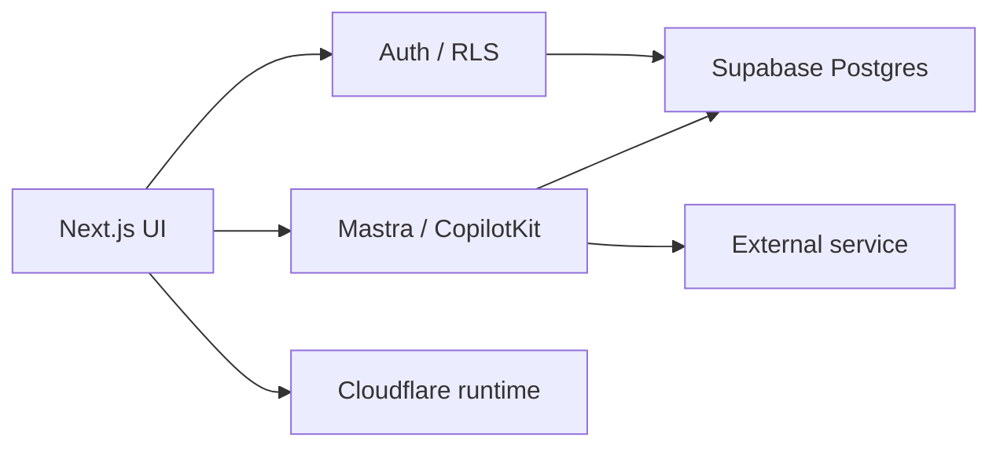
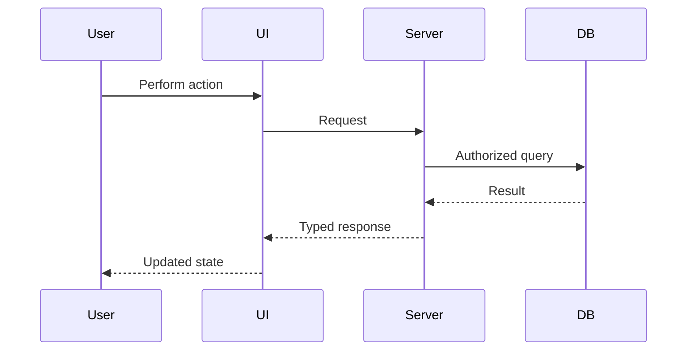

Use this as the **standard agent prompt for cleaning, verifying, and upgrading Linear tasks before implementation**.

````markdown
# Linear Task Best-Practice Agent Prompt

You are preparing a Linear task so another coding agent can implement it safely and efficiently.

Your job is to:
- verify the task against the current codebase
- verify Supabase/database state where relevant
- remove stale assumptions and blockers
- improve the title and description
- make the task easy to understand
- define the fastest safe implementation path
- add exact verification and production-readiness criteria

Always reference the task as:

# IPI-XXX · TASK-ID — Full Plain-English Outcome

---

## Implementation prompt

Complete this task in this order:

1. Read the full Linear issue, comments, relations, milestone, attachments, linked documents, and related issues.
2. Inspect current `origin/main`, current branch, worktrees, open PRs, and recent changelog before changing anything.
3. Verify the reported problem still exists in the current codebase.
4. Inspect the current Supabase schema, migrations, RPCs, views, RLS policies, generated types, and live data contracts when relevant.
5. Verify every blocker and dependency against current Linear state and repository evidence. Remove stale blockers.
6. Resolve the canonical DESIGN V2 source under `Universal-design-prompt-4/`.
7. Search for existing components, hooks, queries, RPCs, helpers, CSS/tokens, tests, Playwright utilities, agents, workflows, and vendor integrations.
8. Check dashboards, official documentation, CLI capabilities, SDKs, GitHub repos, examples, recipes, and prebuilt modules before writing custom code.
9. Ask: **Is there a better, faster, safer, or more reusable way to complete this task?** Use it if verified.
10. Choose the smallest production-safe implementation that solves the actual user problem.
11. Keep one concern per PR. Split the task if it mixes unrelated UI, schema, AI, infrastructure, or migration work.
12. Implement using existing project patterns before adding new abstractions.
13. Run focused tests first, then typecheck, lint, build, database/security checks, browser verification, and visual comparison.
14. Verify the authenticated real workflow end-to-end, not only individual components or unit tests.
15. Attach evidence and remaining gaps before changing the task to Done.

Rules:

- Never assume old Linear text is current.
- Never create duplicate components, APIs, RPCs, agents, or workflows without proving reuse is impossible.
- Never mark Done because code exists or a PR merged.
- Done requires verified observable production behavior.
- Prefer CLI, dashboards, official SDKs, existing modules, examples, and tested repository patterns before custom code.
- If current code contradicts the task, update the task before implementation.

---

## Purpose

Explain in 2–4 sentences:

- What problem is being solved?
- Why does it matter?
- Who benefits?
- What happens if it is not fixed?

---

## Real-world example

Describe one simple real-world scenario.

Example:

> A producer opens Matching for a shoot, compares available talent, shortlists two candidates, and continues without switching tools or seeing stale data.

---

## User outcome

After completion, the user can:

- [clear observable outcome]
- [clear observable outcome]
- [clear observable outcome]

Avoid implementation language here.

---

## Problem being solved

### Current problem

Describe what is broken, missing, slow, confusing, unsafe, duplicated, or inconsistent.

### Root cause

State the verified technical cause.

### Expected behavior

Describe exactly what should happen after the fix.

---

## User journey

```mermaid
flowchart LR
    A[User starts workflow] --> B[System loads required data]
    B --> C{Result}
    C -->|Success| D[User completes primary action]
    C -->|Empty| E[Useful empty state]
    C -->|Error| F[Retry / recovery]
    D --> G[Success state]
````

Adjust this diagram to the actual task.

---

## Design source of truth

* Canonical HTML:
* Canonical task spec:
* Canonical screen/component:
* Expected route:
* Shared component references:
* Expected desktop behavior:
* Expected mobile/tablet behavior:
* Intentional deviations:
* Historical references that must not override current SSOT:

For DESIGN V2, resolve the current source under:

`Universal-design-prompt-4/`

Do not redesign from screenshots or memory.

---

## Current implementation proof

Verified against:

* `origin/main` commit:
* Current branch:
* Current route:
* Existing component:
* Existing data source:
* Existing RPC/API:
* Existing Supabase table/view:
* Existing RLS/auth path:
* Existing tests:
* Open PR/worktree collision:
* Last verified date:

Record evidence before coding.

---

## Dependency verification

| Dependency | Linear status | Technically required? | Evidence                    | Action                 |
| ---------- | ------------- | --------------------: | --------------------------- | ---------------------- |
| IPI-XXX    | Done          |                    No | merged code exists          | remove blocker         |
| IPI-YYY    | Todo          |                   Yes | required RPC missing        | keep blocker           |
| IPI-ZZZ    | Backlog       |             Soft only | affects optional AI feature | do not block core task |

Rules:

* Completed dependencies must not remain hard blockers.
* Unrelated tasks must be removed.
* Soft dependencies must be clearly identified.
* Verify dependencies against both Linear and code.

---

## Faster implementation / reuse audit

Before creating code, check:

* Existing shared component
* Existing workspace/page pattern
* Existing CSS/module/token
* Existing query/RPC
* Existing Supabase view/function
* Existing generated types
* Existing utility/helper
* Existing test fixture
* Existing Playwright helper
* Existing shadcn component
* Existing CopilotKit integration
* Existing Mastra agent/workflow/tool
* Existing Cloudflare Worker/binding
* Existing Cloudinary integration
* Existing vendor SDK/module
* Existing GitHub example/tutorial/recipe

### Better/faster path

Answer explicitly:

**Is there a better, faster, safer, or more efficient way to complete this task?**

* Best option:
* Why:
* Existing module/pattern reused:
* Custom code avoided:
* Estimated risk reduction:

Custom code still required:

---

## Scope

### In scope

* [specific change]
* [specific change]
* [specific change]

### Out of scope

* [related but separate change]
* [future enhancement]
* [different subsystem]

Keep scope PR-sized.

---

## Tech stack

| Layer         | Technology                       | Purpose            |
| ------------- | -------------------------------- | ------------------ |
| Frontend      | Next.js / React                  | UI                 |
| Design        | DESIGN V2 / shadcn / tokens      | visual parity      |
| Database      | Supabase / Postgres              | source of truth    |
| Auth          | Supabase Auth / RLS              | tenant security    |
| AI            | Mastra / CopilotKit              | agent interactions |
| Runtime       | Cloudflare                       | hosting/runtime    |
| Media         | Cloudinary                       | assets             |
| Testing       | Vitest / Playwright              | verification       |
| Observability | DevTools / logs / Sentry if used | runtime proof      |

Only include technologies actually relevant to the task.

---

## Skills / MCPs / dashboards / CLI

Use the appropriate tools before custom implementation.

### Skills

* task-verifier
* design-to-production
* ipix-supabase
* nextjs-developer
* copilotkit
* mastra
* Cloudflare-related skills
* task-specific project skills

### MCPs

* Linear MCP — issue/dependency verification
* GitHub — PRs, branches, CI, examples
* Supabase — schema/RPC/RLS inspection
* Context7 — current library documentation
* Chrome DevTools — browser/runtime inspection
* Playwright — E2E
* Cloudflare MCP — runtime/configuration
* Cloudinary MCP — media tasks
* CopilotKit MCP — CopilotKit docs/runtime
* Mastra MCP — Mastra docs

### Dashboards / CLI

Prefer existing dashboards and CLI before writing custom tooling.

Examples:

```bash
gh pr list
gh pr checks

supabase migration list --linked
supabase db lint

wrangler types
wrangler deploy --dry-run

npx playwright test
```

Use only commands valid for the repository.

---

## Architecture / data flow



Replace this with the actual task flow.

For data-heavy tasks, also include:



---

## Implementation steps

1. Reproduce and document the current issue.
2. Confirm the source of truth and expected behavior.
3. Verify current code/data/auth setup.
4. Revalidate dependencies.
5. Perform reuse audit.
6. Select the fastest safe solution.
7. Implement the smallest change.
8. Add/update focused tests.
9. Verify security and tenant isolation where relevant.
10. Run browser/E2E workflow.
11. Compare against DESIGN V2 if UI-related.
12. Record production evidence.
13. Document remaining follow-up work separately.

For every step, ask:

> Can this be completed more safely or efficiently using an existing component, RPC, SDK, CLI, dashboard, module, example, or project pattern?

---

## Success criteria

The task is successful when:

* the original user problem is no longer reproducible
* the expected workflow works using real data
* no duplicate implementation was introduced
* existing functionality does not regress
* required security boundaries remain intact
* required DESIGN V2 parity is achieved
* tests and browser verification pass
* evidence is attached

---

## Acceptance criteria

* [ ] Primary user outcome works
* [ ] Real data is used where required
* [ ] Loading state works
* [ ] Empty state works
* [ ] Error/recovery state works
* [ ] Populated/success state works
* [ ] Relevant interactions work
* [ ] No stale dependency remains
* [ ] No unnecessary custom code introduced
* [ ] Tests pass
* [ ] Authenticated browser workflow passes

Add task-specific criteria.

---

## Parity acceptance

For DESIGN V2 tasks:

* [ ] Layout matches canonical DC
* [ ] Typography matches
* [ ] DESIGN V2 tokens used
* [ ] Loading state
* [ ] Empty state
* [ ] Error state
* [ ] Populated state
* [ ] Selection/interaction states
* [ ] Desktop viewport verified
* [ ] Mobile/tablet verified if in scope
* [ ] Keyboard/focus behavior verified
* [ ] No undocumented visual deviation
* [ ] Before/after screenshots recorded

---

## Security / tenancy / data

Verify where relevant:

* [ ] authenticated access
* [ ] org-scoped data
* [ ] RLS behavior
* [ ] no service-role access from browser
* [ ] no cross-tenant data exposure
* [ ] write operations use approved authorization path
* [ ] AI cannot bypass business authorization
* [ ] migrations are reversible/safe
* [ ] secrets are not committed
* [ ] generated types match current schema

If Supabase changes:

* inspect tables
* inspect RLS
* inspect policies
* inspect functions/RPCs
* inspect migrations
* regenerate types if required
* run RLS/security probes

---

## Testing

Run focused tests before broad tests.

Example:

```bash
cd app

npm test -- <focused-test>
npx tsc --noEmit
npm run lint
CI=true npm run build
```

Then task-specific checks.

Database task examples:

```bash
supabase db lint
supabase migration list --linked
```

Cloudflare examples:

```bash
wrangler types
wrangler deploy --dry-run
```

Do not blindly run commands that do not apply.

---

## Browser / E2E verification

Verify the real authenticated workflow.

Check:

* route loads
* no console errors
* expected network requests
* correct success state
* loading state
* empty state
* error/retry state
* responsive behavior
* keyboard/focus behavior
* screenshots
* Playwright flow

Record exact route and viewport.

---

## Reference links

Add direct useful links:

* Linear issue:
* Related Linear tasks:
* GitHub repository:
* Relevant PR:
* Canonical design:
* Supabase docs:
* Cloudflare docs:
* CopilotKit docs:
* Mastra docs:
* Vendor documentation:
* Relevant GitHub example/tutorial/recipe:

Prefer official documentation and primary repositories.

---

## Production evidence

* PR:
* Commit:
* CI:
* Browser route:
* Focused tests:
* Typecheck:
* Lint:
* Build:
* Supabase verification:
* RLS/security verification:
* Playwright:
* Screenshot:
* Console:
* Network:
* Accessibility:
* Performance:
* Parity score:
* Remaining known gaps:

---

## Risks and rollback

| Risk                     | Impact | Mitigation              |
| ------------------------ | ------ | ----------------------- |
| Regression               | Medium | focused + E2E tests     |
| Tenant data exposure     | High   | RLS/auth probes         |
| Design drift             | Medium | canonical DC comparison |
| Duplicate implementation | Medium | reuse audit             |

Rollback:

* application change → revert PR
* migration → documented rollback migration
* configuration → restore previous config
* feature flag → disable flag if available

---

## Agent suitability

Recommended executor:

* [ ] Grok Build
* [ ] Claude Code
* [ ] Devin
* [ ] Human-led

Autonomy:

* [ ] High — deterministic app/test change
* [ ] Medium — multi-file integration
* [ ] Human review required — RLS/schema/security
* [ ] Human approval required — production/destructive change

Explain why.

---

## Production-ready checklist

* [ ] Current problem reproduced before change
* [ ] Current `main` verified
* [ ] Supabase setup verified if relevant
* [ ] Dependencies revalidated
* [ ] Reuse audit completed
* [ ] Faster implementation path evaluated
* [ ] Scope remains PR-sized
* [ ] Code follows existing architecture
* [ ] No unnecessary custom implementation
* [ ] Unit/focused tests pass
* [ ] Typecheck passes
* [ ] Lint passes
* [ ] Build passes
* [ ] Security/RLS checks pass
* [ ] Authenticated browser workflow passes
* [ ] Playwright passes where applicable
* [ ] DESIGN V2 parity verified
* [ ] Console/network clean
* [ ] Accessibility checked
* [ ] Performance checked where relevant
* [ ] Production evidence attached
* [ ] Rollback documented
* [ ] Remaining work moved to follow-up tasks

---

## Definition of Done

This task is Done only when:

1. The current codebase and Supabase setup have been verified.
2. The original problem is proven fixed.
3. The real authenticated user journey succeeds.
4. Acceptance and parity criteria pass.
5. Relevant tests, typecheck, lint, build, database/security checks, and E2E verification pass.
6. Production evidence is attached.
7. No stale blockers remain.
8. No unresolved high-risk issue is hidden.
9. Any remaining work has its own Linear task.

**Merged does not equal Done. Verified production-ready behavior equals Done.**

```

This is concise enough for an agent, but complete enough to make tasks **implementation-ready instead of just descriptive**. It also forces the agent to verify the codebase and Supabase before trusting old Linear text, which is one of the most important improvements for iPix.
```
