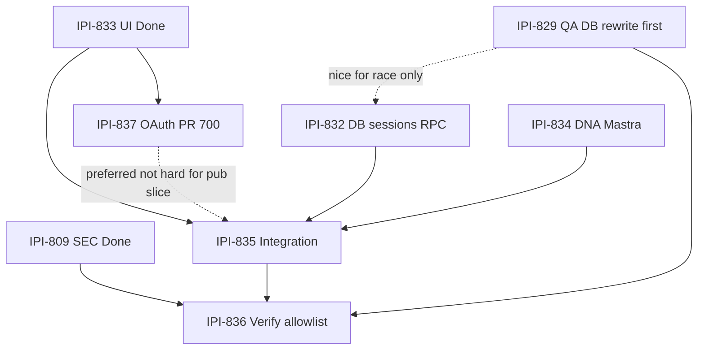
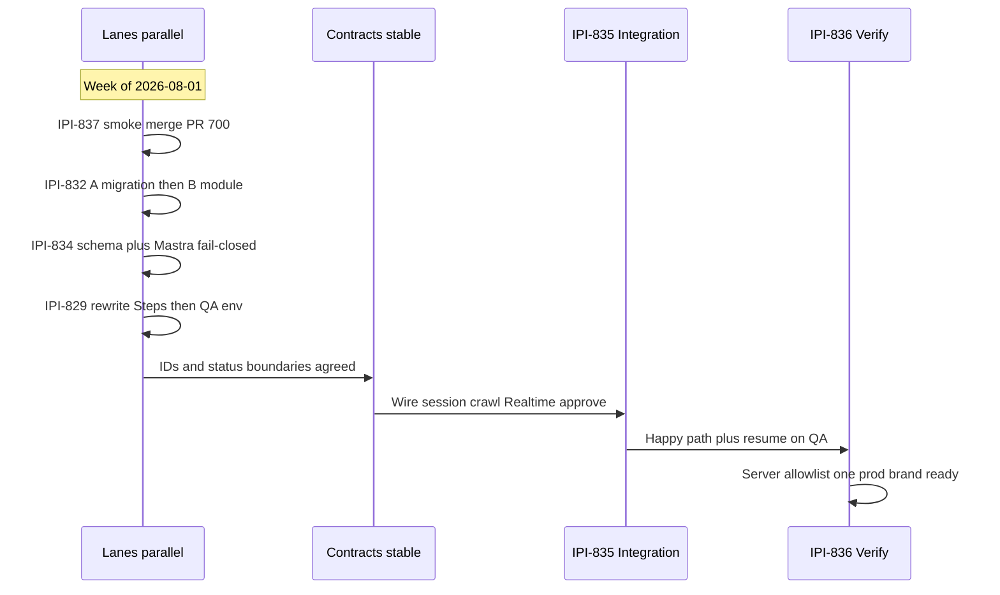
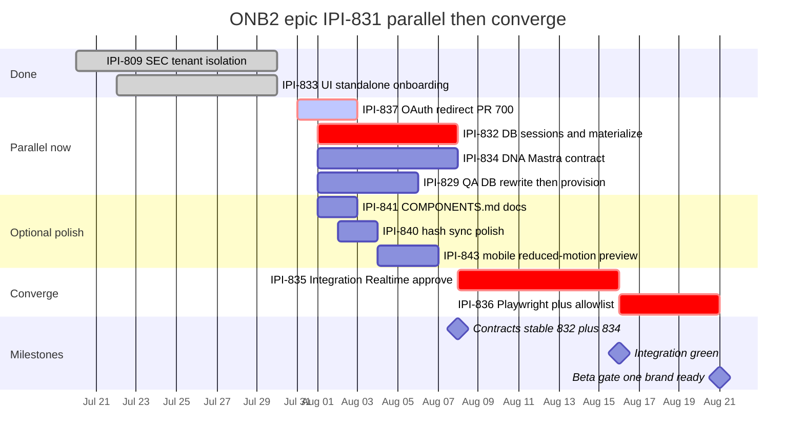

## Schedule — 2026-08-01 task-verifier refresh

Parent tracker only. **Do not open an implementation PR from this epic.**

### Verified current state — 2026-08-01

| Fact | Status |
| -- | -- |
| IPI-809 · SEC-ONB-001 tenant isolation | Done — do not reopen |
| IPI-833 · ONB2-UI-001 standalone `/onboarding` | Done on prod |
| IPI-837 · Google OAuth redirect | In Progress — PR #700; `main` still hardcodes `/app` |
| `onboarding_sessions` / materialize RPC | Absent — IPI-832 |
| Mastra DNA fail-closed | Still `{ ok: boolean }` — IPI-834 |
| Realtime publishes `brands` | No — IPI-835 |
| QA DB for Playwright | Rewrite Steps first — IPI-829 |
| Legacy `/app/onboarding` | Keep until IPI-836 green |

Audit: `tasks/design-docs/onboarding/task-verifier-audit-2026-08-01.md`

### Delivery graph — parallel then converge

**Shared contract before parallel coding:** lock session/brand/crawl/draft IDs and `OnboardingSessionStatus = draft | materialized`. Do **not** invent a unified mega-status enum that mixes session + `brands.intake_status` + UI phases.

### Task sequence

### Gantt — planned delivery window

Durations are planning estimates — adjust as PRs land.

Note: IPI-835 also waits on IPI-834 finishing in the same week as IPI-832 — treat `after db` as the contracts-stable gate when both land.

### Implementation order

| Order | Issue | Can start? | Blocked by |
| -- | -- | -- | -- |
| Done | IPI-809 · SEC-ONB-001 | — | — |
| Done | IPI-833 · ONB2-UI-001 | — | — |
| Now parallel | IPI-837 · AUTH-OAUTH-001 | Finish smoke, merge #700 | 833 Done |
| Now parallel | IPI-832 · ONB2-DB-001 | Slices A/B; race C needs QA | Not hard-blocked by 829 |
| Now parallel | IPI-834 · ONB2-AI-001 | Yes | — |
| Now parallel | IPI-829 · ONB-QA-001 | After Steps rewrite — no fake migration repair | — |
| Then | IPI-835 · ONB2-INT-001 | After 832 + 834; 837 preferred | 832, 833, 834 |
| Last | IPI-836 · ONB2-VERIFY-001 | Scaffold early; complete last | 835, 829, 809 |
| Optional | IPI-840 / IPI-841 / IPI-843 | Anytime | Fold 843 into 836 |

**IPI-832 is not hard-blocked by IPI-829.** Tenant isolation is enforced at IPI-836.

---
