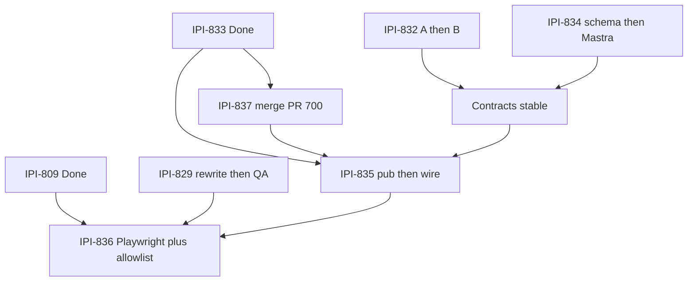

# ONB2 tech plan — optimized execution

**As of:** 2026-08-01 (efficiency playbook added)  
**Project:** [DESIGN V2 — Operator React Parity](https://linear.app/amo100/project/design-v2-operator-react-parity-e276f28e26a0/issues)  
**Epic:** [IPI-831 · ONB2-EPIC-001](https://linear.app/amo100/issue/IPI-831/ipi-831-onb2-epic-001-onboarding-v2-delivery-new-brands-reach-ready)  
**Evidence tip:** `origin/main` @ `aa047ad1` · PR [#700](https://github.com/amo-tech-ai/lumina-studio/pull/700) OPEN (837) · Prod Realtime pubs: `brand_crawls`, `brand_crawl_results` only (`brands` **not** published)

Sibling audits: [`summary.md`](./summary.md), [`task-verifier-audit-2026-08-01.md`](./task-verifier-audit-2026-08-01.md).  
Linear specs for **829 / 832 / 834** were corrected 2026-08-01 (stale→808 removed; 829 Steps rewritten).

---

## Verdict

| Item | Result |
| --- | --- |
| Composite readiness to **start** parallel work | **~85 / 100** after Linear corrections |
| Production beta readiness (Ready brand E2E) | **~28%** (UI ~90%, backend path incomplete) |
| **Decision** | **GO** |

Start now: **837 smoke+merge**, **832 A/B**, **834**, **829 Step 0 then provision**, **841**, tiny **840**.  
Wait for full **835** until 832+834 land. Wait to **complete 836** until 835+829.  
Do **not** invent a unified onboarding mega-status enum.

---

## Fastest path per task (do this — skip the rest)

Rule for every ticket: **Dashboard → CLI → reuse in-repo → official recipe → custom last.**  
If a row says “already done,” don’t rebuild it.

| Task | Fastest path | Skip / don’t build | Time box |
| --- | --- | --- | --- |
| **837** | **Smoke Google on PR #700 preview → merge.** Code already has `oauth_next` cookie + `safeRedirect`. | New OAuth stack, Dashboard wildcard, second redirect helper | ~30–60 min |
| **832** | Paste Linear SQL into **one migration PR (A)** → `git mv` + single RPC call **(B)** → race only when QA exists **(C)**. Prefer **stable `localStorage` idempotency_key** over a second unique index if you want fewer SQL objects. | App-layer multi-insert “transaction”, DEFINER RPC, waiting on 829 for A/B, mega-status enum | A: half day · B: half day · C: after 829 |
| **834** | Extend `brand-profile.schema.json` claims → wire Mastra `structuredOutput` / step schema from **that file** → parity fixtures. Leave approve + `promoteBrandDraft` alone. | New Zod SSOT, new approval route, new AI client, `pending_approval` | 1–2 days |
| **829** | **Done path (2026-08-01):** Option **B** — staging `wtuhdynujhszsbwxlbdi` caught up **219→277**, pgTAP 514/514, GitHub `QA_DATABASE_URL` (+ QA keys) set. Option A blocked (Branching **402** / Pro). Infisical optional for local. | Repair theatre, pointing Playwright at prod | ✅ provisioned; slice C / 836 unblocked |
| **835** | **Slice A first:** one `ALTER PUBLICATION` for `brands (id, intake_status, updated_at)`. Then wire onboarding screen 12 to same subscribe helper as banner. Delete `/app/onboarding` **last**. | Custom poller, second progress bus, client-side “failed” timer, early legacy delete | Pub: 1 hr · wire: multi-day |
| **836** | Scaffold `e2e/14-…` + page objects **now** (no Done claim). Finish after 835. Server `ONBOARDING_V2_ALLOWLIST` only. Fold **843** into projects `mobile-390` + `reducedMotion`. | `NEXT_PUBLIC_*` flag, 5-project × retries matrix, Playwright fault-injection | Scaffold: 0.5 day · Done: after 835+829 |
| **840** | One `replaceState` on popstate + 2 tests | Router rewrite, hash→path migration | &lt;2 hr |
| **841** | Docs-only COMPONENTS.md PR | Product code | &lt;1 hr |
| **843** | Don’t run as critical path — checklist row inside **836** | Separate preview marathon | fold |

### Cheat sheet — “already built, only glue”

| Need | Reuse this |
| --- | --- |
| Safe redirect | `app/src/lib/safe-redirect.ts` (+ PR #700 cookie) |
| Org+brand create | Replace `createOrgAndBrand` with RPC from 832 Linear body |
| DNA shape | `supabase/functions/_shared/schemas/brand-profile.schema.json` |
| Validate DNA | `validateBrandProfilePayload()` |
| Approve → Ready | `POST /api/workflows/brand-intelligence/approve` + `promoteBrandDraft` |
| Crawl kickoff | `invokeStartBrandCrawl` |
| Progress copy | `format-crawl-progress.ts` |
| Progress UI pattern | `analysis-progress-banner.tsx` → share with `analysis-progress-screen.tsx` |
| Stall = failed | existing `expire_stale_brand_analysis` cron — client never decides |
| E2E harness | root `playwright.config.ts` projects |
| QA auth | `qa@ipix.test` / `QA_PASSWORD` |

### Anti-patterns (waste days)

1. Rewriting OAuth when #700 only needs smoke + merge  
2. Waiting on QA DB before 832 migration  
3. Second Brand DNA Zod file  
4. `migration repair` to pretend Mastra exists on staging  
5. Custom progress websocket instead of Realtime publication  
6. `NEXT_PUBLIC_ONBOARDING_V2_ENABLED` for one-brand rollout  
7. Deleting `/app/onboarding` before v2 materialize+crawl works  

---

## Ladder (universal)

| Rung | Prefer | Avoid |
| --- | --- | --- |
| 1 Dashboard | Auth URL allowlist, Publications, Advisors | Hand-editing remote schema |
| 2 CLI | `supabase db push`, `migration list`, `test db`, Playwright `--project` | Fake `migration repair` for absent schema |
| 3 Prebuilt | `safeRedirect`, approve route, `promoteBrandDraft`, AI Gateway, Realtime banner/formatter | Second OAuth validator / second approval API / new progress bus |
| 4 Official recipe | Next.js OAuth `next=`, Mastra `structuredOutput`, PG column-list publication | Mega-status enums |
| 5 Custom | Thin glue only | Parallel SSOTs |

---

## Optimization matrix

| Task | Existing feature to reuse | Dashboard/CLI action | Minimal custom code | Errors in current task | Corrected dependencies | Can run in parallel? |
| --- | --- | --- | --- | --- | --- | --- |
| **IPI-837** · AUTH-OAUTH-001 In Progress | `safeRedirect()` (`/app`, `/onboarding`); login email path; `callback/route.test.ts` | Stage 0: Auth → URL Configuration (exact callback). Prefer cookie carrier if no query allowlist | Cookie/query carrier + callback `safeRedirect` (PR #700) | `main` still hardcodes `successUrl=/app`; smoke not Done | blockedBy **833 Done**; blocks **835** preferred not absolute for pub-only slice; related 125 | ✅ Yes — finish/merge alone |
| **IPI-832** · ONB2-DB-001 Todo | `onboarding.ts` create path (replace); org/brand insert policies; pgTAP harness; `booking-sql-fixture-containment` | Advisors after migrate; `supabase test db` | Migration: `onboarding_sessions` + `materialize_onboarding_session` INVOKER RPC; module `git mv` | ~~blocks 808~~ fixed; AC now `draft\|materialized` + idempotency | blocks **835** only; related **829** (slice C); A/B not blocked by 829 | ✅ Yes ∥ 837/834/829 |
| **IPI-834** · ONB2-AI-001 Todo | `brand-profile.schema.json` + `validateBrandProfilePayload`; `saveDraftAndWait`; approve route; `promoteBrandDraft`; AI Gateway | None (no migration) | Extend JSON Schema claims/evidence; replace `{ok}`/`{enriched}` with contract; parity tests | ~~blocks 808~~ fixed; don’t invent second Zod SSOT | blocks **835**; no day-0 blockers | ✅ Yes ∥ 832 |
| **IPI-829** · ONB-QA-001 **Done** | Staging QA caught up; GitHub `QA_*` secrets; `qa@ipix.test` | Infisical optional (deferred); keep-alive if free tier | None for CI path | Option **B** (A = 402 Pro); 219→277; pgTAP 514/514 | unblocks **836** + 832 **C** | ✅ Done 2026-08-01 |
| **IPI-835** · ONB2-INT-001 Todo | Banner + `format-crawl-progress`; `invokeStartBrandCrawl`; approve + `promoteBrandDraft`; `expire_stale_brand_analysis`; onboarding screen 12 | Publications: add `brands (id, intake_status, updated_at)` | Wire session↔UI; `subscribe(status)`; drive **analysis-progress-screen** from server truth; retire legacy create path last | Hard `blockedBy` **837** overstated for pub slice A; deletes `/app/onboarding` too early if B ships alone; must wire onboarding screen not only Brand Hub banner | Hard: **832+833+834**. Soft: **837** for Google cutover. Pub slice A can start after Dashboard confirm | 🟡 Pub A early; full wiring after 832+834 |
| **IPI-836** · ONB2-VERIFY-001 Todo | `playwright.config.ts` projects; `e2e/13-*` → next `14-`; prod smoke pattern; QA creds | Vercel/Infisical **server** env allowlist | Pin chromium (+ mobile/reduced-motion); SQL row-count asserts; allowlist gate | Correction vs AC#9 still mentions `NEXT_PUBLIC_ONBOARDING_V2_ENABLED`; forced-failure E2E vs correction conflict | blockedBy **835+829**; **809 Done** (satisfied); fold **843** | Scaffold ✅ now; complete ❌ until 835+829 |
| **IPI-840** · hash sync Todo | `use-screen-history.ts` (initial clamp mostly Done) | None | popstate `replaceState` + tests | Scope already mostly shipped — don’t re-investigate | related 833; does not block 835 | ✅ Anytime |
| **IPI-841** · COMPONENTS.md Todo | Live onboarding components | None | Docs-only PR | None material | none | ✅ Anytime (docs-only) |
| **IPI-843** · mobile/a11y Todo | Playwright `mobile-390`, `reducedMotion` | Preview deploy | Prefer fold into **836** | Duplicate of 836 mobile AC if both critical-path | fold into 836; optional early preview | ✅ Optional early |
| **IPI-831** · epic In Progress | Children tracker | None | Tracker only — no impl PR | Was stale (tenant leak / no route group); schedule refreshed 2026-08-01 | Parent of ONB2 graph | N/A tracker |

**Stale edge (fix in Linear when editing):** **IPI-832** and **IPI-834** still `blocks` → [IPI-808](https://linear.app/amo100/issue/IPI-808) (**Canceled** 2026-07-27). Remove both.

---

## Corrected acceptance criteria (execute against these)

### IPI-837
- [ ] Stage 0 Redirect URLs pasted in PR; carrier justified
- [ ] Google + `redirect=/onboarding` → authenticated `/onboarding`
- [ ] Unsafe targets → `/app`; failures preserve safe `redirect` on `/login`
- [ ] Reuses `safeRedirect` only; email path unchanged
- [ ] Preview/prod Google smoke (not unit-only); merge #700

### IPI-832
- [ ] `onboarding_sessions` with `status in ('draft','materialized')` only — **no** mega-enum
- [ ] `unique (user_id, idempotency_key)` + either partial unique one-draft **or** documented stable browser key
- [ ] `materialize_onboarding_session` SECURITY INVOKER; pre-gen UUIDs; no `INSERT … RETURNING` trap
- [ ] RLS own-row; revoke PUBLIC/anon EXECUTE
- [ ] Slices A→B→C; race test only when `QA_DATABASE_URL` set
- [ ] Does not claim Done via canceled IPI-808

### IPI-834
- [ ] SSOT remains `supabase/functions/_shared/schemas/brand-profile.schema.json`
- [ ] Claims require non-empty evidence (URL + quote)
- [ ] Mastra `extractProfile` / `fanOutEnrichment` fail closed (not `{ ok: boolean }` / `{ enriched: boolean }`)
- [ ] Parity tests Edge ↔ Mastra; reuse suspend/approve/`promoteBrandDraft`
- [ ] No second Zod SSOT; no `pending_approval` invent

### IPI-829
- [ ] Human chose A (prod-like QA / Branching) or B (staging catch-up **without** ledger lies)
- [ ] Steps rewritten to live counts (prod ahead of staging; re-probe at execute time)
- [ ] **Delete** Steps that `migration repair --status applied` absent Mastra/Hyperdrive schema
- [ ] `QA_DATABASE_URL` ≠ prod ref; `qa@ipix.test` can sign in; pgTAP green on QA
- [ ] Blocks only Playwright completion (836), not 832 A/B / 834

### IPI-835
- [ ] Publication: `brands (id, intake_status, updated_at)` only — no draft/token leak
- [ ] `.subscribe((status) => …)` distinguishes connection lost vs server `failed` vs slow
- [ ] Client never marks analysis failed; reuse `expire_stale_brand_analysis`
- [ ] Session create/resume/materialize; real crawl; **onboarding** `analysis-progress-screen` driven by server truth
- [ ] Approval via existing route → `ready`; delete `/app/onboarding` only after new path proven
- [ ] Keep `OnboardingSessionStatus` ≠ `brands.intake_status`

### IPI-836
- [ ] `e2e/14-onboarding.spec.ts` (or next free): happy path + resume; project-pinned
- [ ] SQL proves 1 session / 1 org / 1 brand / 1 crawl
- [ ] Server `ONBOARDING_V2_ALLOWLIST` (+ optional server `ONBOARDING_V2_ENABLED`) — **never** `NEXT_PUBLIC_*`
- [ ] Fold mobile 390 + `prefers-reduced-motion` (843 checklist)
- [ ] One allowlisted prod brand → `intake_status = 'ready'` with evidence; rollback documented
- [ ] Scaffolding ≠ Done

### Polish
- **840:** popstate hash sync + tests (initial load mostly Done)
- **841:** docs-only COMPONENTS.md truth
- **843:** fold into 836 unless early preview needed

---

## Exact surfaces (files · migrations · dashboards · commands)

| Task | Files / migrations | Dashboard | Commands |
| --- | --- | --- | --- |
| **837** | `login-form.tsx`, `auth/callback/route.ts` (+ tests), `safe-redirect.ts` | [Auth URL Configuration](https://supabase.com/dashboard/project/nvdlhrodvevgwdsneplk/auth/url-configuration) | `npx vitest run src/components/marketing src/app/auth src/lib/safe-redirect.test.ts`; Google smoke on preview; merge #700 |
| **832** | `supabase/migrations/<ts>_onboarding_sessions_and_materialize_rpc.sql`; `008_onboarding_sessions.sql`; `app/src/lib/onboarding.ts` → `onboarding/`; integration race test | Advisors after apply | Slice A: `supabase db push`; B: app tests; C: `supabase test db --db-url "$QA_DATABASE_URL"` + vitest race |
| **834** | `brand-profile.schema.json` + `brand-profile.ts`; `brand-intelligence-workflow.ts` (+ tests); optional thin adapter | — | `npx vitest run src/mastra/workflows/brand-intelligence-workflow.test.ts` (+ parity) |
| **829** | secrets / CI only (no prod schema) | Staging or Branching project | `migration list`, `db push --dry-run`, then **honest** apply; never fake repair |
| **835** | `<ts>_brands_realtime_publication.sql`; `009_brands_publication.sql`; onboarding page + `analysis-progress-screen.tsx`; banner subscribe fix; delete legacy page last | [Publications](https://supabase.com/dashboard/project/nvdlhrodvevgwdsneplk/database/publications) | Vitest banner + orchestration; `supabase test db` for 009 |
| **836** | `e2e/14-onboarding.spec.ts`; server allowlist read path; env examples (server keys) | Vercel/Infisical server env | `npx playwright test e2e/14-onboarding.spec.ts --project=chromium-desktop` (+ mobile/reduced-motion) |
| **840** | `use-screen-history.ts` + history tests | — | focused vitest |
| **841** | COMPONENTS.md only | — | docs PR |

---

## Shared-contract collision risks

| Risk | Why it hurts | Rule |
| --- | --- | --- |
| Unified `OnboardingStatus` mega-enum | Collides session + `intake_status` + UI phases | **Split:** session `draft\|materialized`; brand enum stays live DB values; UI phases local |
| Second Brand DNA Zod SSOT | Edge/Mastra drift → Hub vs onboarding disagree | JSON Schema SSOT + parity tests only |
| App-layer “transaction” for org+brand | Orphans on double-tap (today’s bug) | One RPC + unique key + RLS |
| Client timer = progress (screen 12) | Fake fill while backend idle | Realtime + crawl counts; wire **onboarding** screen |
| `NEXT_PUBLIC_` rollout | Build-time; cannot allowlist one brand | Server allowlist only |
| Early delete `/app/onboarding` | Removes working create path before v2 wired | Delete in last proven 835 slice |
| Fake `migration repair` on QA | Ledger lies → Playwright green on wrong schema | Branching / apply real SQL |
| Stale `blocks → IPI-808` | Noise; wrong Done graph | Remove from 832/834 |

**Lock before parallel coding:** session id, brand id, org id, crawl id, draft id; idempotency_key strategy; error/retry ownership (server fails analysis; client only reconnects).

---

## Fastest safe parallel plan

| Lane | Now | Then |
| --- | --- | --- |
| A Auth | Smoke + merge #700 | — |
| B DB | 832 A migration → B module | C race after 829 |
| C AI | 834 schema extend → workflow fail-closed | — |
| D QA | Rewrite Linear Steps → provision | Unlock 836 |
| E Polish | 841 docs; 840 popstate | 843 → 836 |
| F Integrate | 835A publication early OK | Full wire after C |
| G Verify | Scaffold e2e only | Complete after F+D |

---

## Merge order

1. **IPI-837** / PR #700 (after Google smoke)  
2. **IPI-832A** migration (additive)  
3. **IPI-834** schema PR (can interleave with 832A)  
4. **IPI-832B** module RPC call  
5. **IPI-834** workflow enforcement  
6. **IPI-829** QA secrets/CI (docs/ops as own concern)  
7. **IPI-832C** race + pgTAP on QA  
8. **IPI-835A** brands publication  
9. **IPI-835B–D** session wire → progress → approval; delete legacy last  
10. **IPI-836A** Playwright  
11. **IPI-836B** server allowlist  
12. **IPI-836C** one prod brand (comment evidence; no mixed PR)

One concern per PR. Never docs+code. Never 832A+B+C in one PR.

---

## Must wait

| Task | Waits for |
| --- | --- |
| **835** full product wire | 832 + 834 (+ 833 Done); 837 preferred for Google users |
| **836** Done | 835 + 829 (+ 809 already Done) |
| **832C** race | `QA_DATABASE_URL` (829) |
| Prod allowlist flip | Human go-ahead + 836 journeys green |
| Delete `/app/onboarding` | Proven v2 materialize+crawl path |

**Do not wait:** 832 A/B, 834, 829 rewrite, 837 finish, 840/841 — on each other.

---

## Official URL ladder (keep)

### IPI-837 · OAuth
| Kind | URL |
| --- | --- |
| Dashboard | https://supabase.com/dashboard/project/_/auth/url-configuration |
| Docs | https://supabase.com/docs/guides/auth/redirect-urls |
| Docs | https://supabase.com/docs/guides/auth/social-login/auth-google |
| Next recipe | https://supabase.com/docs/guides/auth/social-login/auth-github?framework=nextjs |
| Example callback | https://github.com/vercel/next.js/blob/canary/examples/with-supabase/app/auth/callback/route.ts |

### IPI-832 · Sessions + RPC
| Kind | URL |
| --- | --- |
| Functions | https://supabase.com/docs/guides/database/functions |
| RLS | https://supabase.com/docs/guides/database/postgres/row-level-security |
| pgTAP | https://supabase.com/docs/guides/database/extensions/pgtap |
| CLI push | https://supabase.com/docs/reference/cli/supabase-db-push |
| Locks | https://www.postgresql.org/docs/17/explicit-locking.html#LOCKING-ROWS |

### IPI-834 · Mastra / DNA
| Kind | URL |
| --- | --- |
| Structured output | https://mastra.ai/docs/agents/structured-output |
| Suspend/resume | https://mastra.ai/docs/workflows/suspend-and-resume |
| HITL | https://mastra.ai/docs/workflows/human-in-the-loop |
| CF AI Gateway | https://developers.cloudflare.com/ai-gateway/usage/chat-completion/ |

### IPI-829 · QA
| Kind | URL |
| --- | --- |
| Environments | https://supabase.com/docs/guides/deployment/managing-environments |
| Branching | https://supabase.com/docs/guides/deployment/branching |
| Repair (caution) | https://supabase.com/docs/reference/cli/supabase-migration-repair |

### IPI-835 · Realtime
| Kind | URL |
| --- | --- |
| Publications UI | https://supabase.com/dashboard/project/_/database/publications |
| Postgres Changes | https://supabase.com/docs/guides/realtime/postgres-changes |
| subscribe status | https://supabase.com/docs/reference/javascript/subscribe |
| Column lists | https://www.postgresql.org/docs/17/logical-replication-col-lists.html |

### IPI-836 · Playwright / rollout
| Kind | URL |
| --- | --- |
| Projects | https://playwright.dev/docs/test-projects |
| Reduced motion | https://playwright.dev/docs/emulation#locale--timezone--geolocation--color-scheme--contrast--forced-colors--reduced-motion |
| Next env | https://nextjs.org/docs/app/guides/environment-variables |

---

## Cross-cutting “don’t rebuild”

| Need | Use |
| --- | --- |
| OAuth return | Supabase PKCE + Dashboard URLs + `safeRedirect` |
| Atomic create | Postgres RPC + unique key |
| DNA shape | JSON Schema + Mastra structuredOutput / step schema |
| Approval | Existing Mastra suspend + `/api/workflows/brand-intelligence/approve` |
| Progress | Realtime publication + `subscribe` status → onboarding screen 12 |
| Model routing | Cloudflare AI Gateway `/compat` |
| Chat assist | CopilotKit — not durable form state |
| QA DB | Branching / honest `db push` — not ledger lies |
| Rollout | Server allowlist — never `NEXT_PUBLIC_*` |

**Biggest efficiency wins vs uncorrected tickets:** (1) 829 → Branching/prod-like QA instead of repair theatre, (2) 837 → finish #700, (3) 834 → structuredOutput on existing schema, (4) 835 → Dashboard publication + onboarding screen wire, (5) remove `blocks → IPI-808`.
