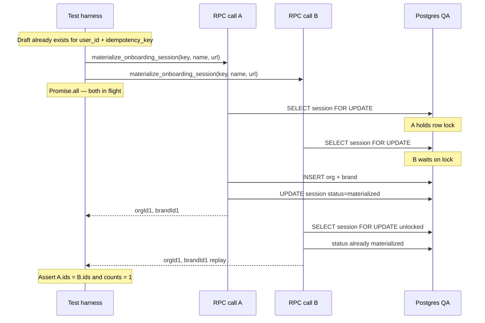
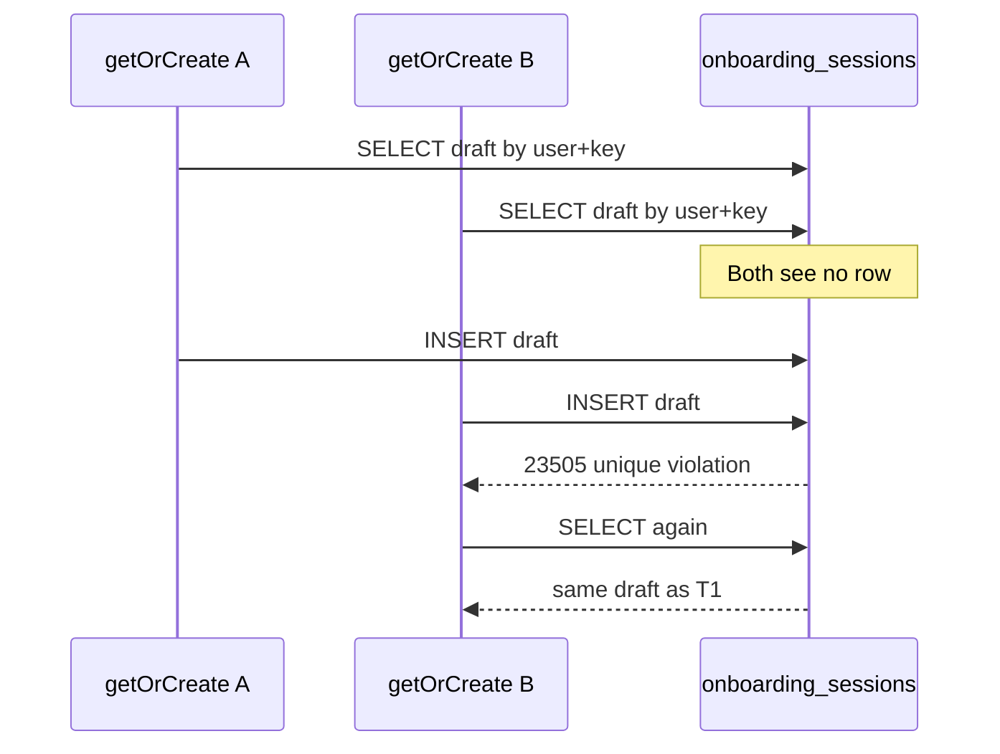
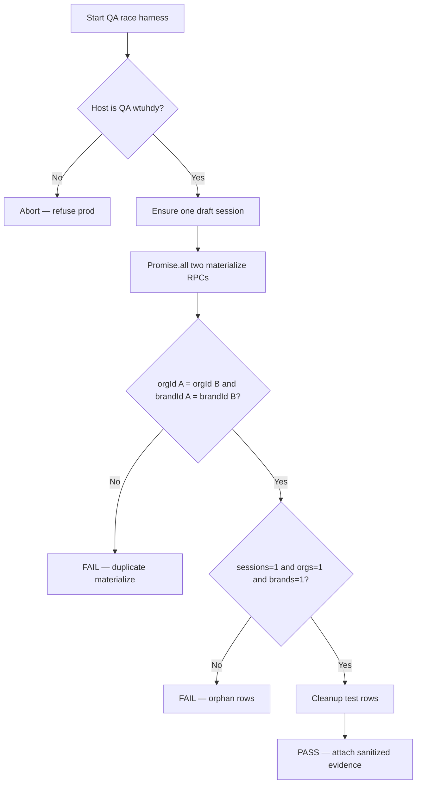
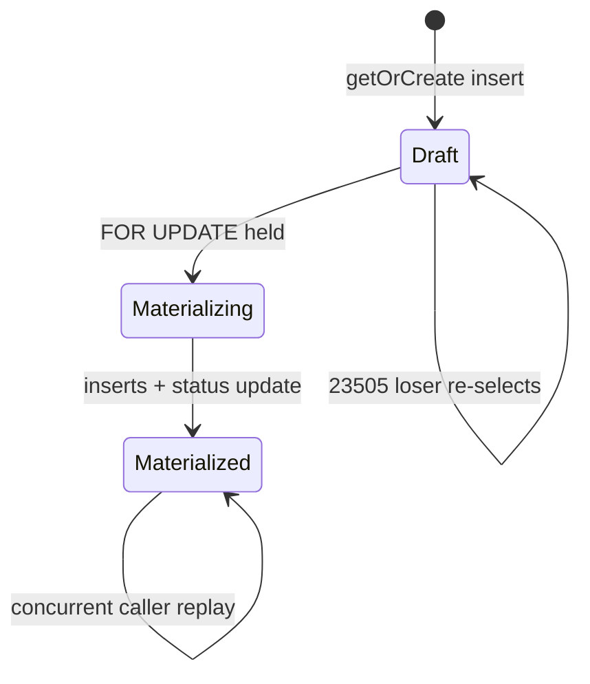

# Verification — **IPI-894 · ONB2-DB-001c — QA race: concurrent materialize returns identical org/brand**

**Linear:** [IPI-894](https://linear.app/amo100/issue/IPI-894/ipi-894-onb2-db-001c-qa-race-concurrent-materialize-returns-identical)  
**Mode:** task-verifier **Full** (pre-execution / spec gate — not Done)  
**Date:** 2026-08-01  
**Baseline:** `origin/main` contains #701 `91bf0395` + #703 `f06c7917`  
**QA:** `wtuhdynujhszsbwxlbdi` via `QA_DATABASE_URL` (`app/.env.local` present)  
**Parent:** [IPI-832 · ONB2-DB-001](https://linear.app/amo100/issue/IPI-832)

Legend: ✅ verified this run · 🟡 fix/note before Done · 🔴 blocker · ⚪ N/A · ⏭️ pending run

---

## Verification report — 2026-08-01 · auditor

| Task | Spec /100 | Execution /100 | Skills /100 | Composite | Blockers | Safe? |
|------|----------:|---------------:|------------:|----------:|----------|-------|
| **IPI-894** | 92 | 5 | 88 | **58** | 0 🔴 | **Yes*** — safe to implement on QA |

Composite: `0.35×92 + 0.40×5 + 0.25×88 ≈ 58` (execution low because race test **not written yet**).

### Skills compliance

| Skill | Required | On disk | MUSTs | Failures |
|-------|:--------:|:-------:|:-----:|----------|
| `task-verifier` | ✅ | ✅ | evidence-first, fail closed | — |
| `ipix-supabase` | ✅ | ✅ | remote-only, no prod writes | — |
| `mermaid-diagrams` | ✅ | ✅ | correct type for race | — |
| `ponytail` | ✅ | ✅ | no DDL; smallest race harness | — |

### Claims verified / not verified

| Claim | Probe | Result |
| --- | --- | --- |
| #701 / #703 on `origin/main` | `merge-base --is-ancestor` | ✅ |
| Migration `20260801051934` on main | `git show origin/main:…51934…` (145 lines) | ✅ |
| pgTAP `008` on main | `git ls-tree …008_onboarding_sessions.sql` | ✅ |
| `QA_DATABASE_URL` in `app/.env.local` | `rg -c '^QA_DATABASE_URL='` → 1 | ✅ |
| QA has table+RPC (prior audit) | Supabase MCP 2026-08-01 | ✅ |
| Live `Promise.all` race PASS | — | ⏭️ **this task** |
| Production untouched by this task | AC / non-goals | ⚪ until implement |

### Red flags

| Flag | Sev | Evidence |
| --- | --- | --- |
| Race test must **pre-create draft** before `Promise.all` | 🟡 | RPC raises `P0002` if session missing — concurrent materialize alone is not the product path |
| `FOR UPDATE` alone does not stop double **draft insert** | 🟡 | Migration comment: unique `(user_id, idempotency_key)` is the get-or-create primitive |
| Different payload + same key | 🟡 | Extra AC: fail/conflict — not silent dual outcome; may follow-up if large |
| CI booking-gate IPv6 | ⚠ infra | **IPI-892** — use pooler/`QA_DATABASE_URL` that works from runner/dev host |
| Do not expand `008` | ✅ scope | That is **IPI-893** |

### Failure points (pre-mortem)

1. **Harness races get-or-create instead of materialize** → unique `23505` noise; still must assert one session, but misses the org/brand lock path.  
2. **Sequential `await` disguised as concurrent** → false green. Must fire both RPCs without awaiting the first.  
3. **Service-role bypass** → skips INVOKER/RLS; use authenticated JWT for the real path.  
4. **Cleanup deletes wrong rows** → use unique suffix on brand name / key; delete only test-tagged rows.  
5. **Prod URL accidental** → hard-fail if host ≠ `wtuhdynujhszsbwxlbdi`.

### Stop condition

> ✅ **Safe to execute** on QA only. Zero 🔴 blockers.  
> Do **not** mark Done until live race evidence is attached (anti-fake-done).

---

## How the RPC serializes (probed)

| Layer | Mechanism |
| --- | --- |
| Draft uniqueness | `UNIQUE (user_id, idempotency_key)` |
| Materialize lock | `SELECT … FOR UPDATE` on session row |
| Replay | If `status = 'materialized'` → return stored org/brand IDs |
| Outcome UPDATE | `set_config('app.onboarding_materializing','on', true)` for RLS |
| Org/brand inserts | Pre-generated UUIDs; serialized behind session lock (no `ON CONFLICT` on org) |

---

## Diagrams

### 1. Happy path — concurrent materialize (same key)

What **IPI-894** must prove: two in-flight RPCs, one durable org/brand.



### 2. Draft get-or-create race (app layer — #703)

Separate from materialize; unique constraint is the safety net.



### 3. Decision tree — what IPI-894 asserts



### 4. State machine — session under race



---

## Recommended harness shape (ponytail)

```text
1. Assert QA_DATABASE_URL host = wtuhdynujhszsbwxlbdi
2. Create/sign-in dedicated QA user (or fixture JWT)
3. idempotency_key = `ipi894-${unique}`
4. Insert/get draft session (status=draft)
5. const [a,b] = await Promise.all([rpc(...), rpc(...)])
6. Assert a.organization_id === b.organization_id
7. Assert a.brand_id === b.brand_id
8. COUNT(*) filters by key/suffix → 1 / 1 / 1
9. Delete test session + org + brand (QA only)
10. Repeat ×3; document command in PR
```

Suggested location (one concern — tests only):  
`supabase/tests/database/` **or** `app/src/test/onboarding-race.qa.test.ts` gated on `QA_DATABASE_URL` (skip in default CI if IPv6 broken — **IPI-892**).

---

## Commands before / after execution

**Before**

```bash
# Confirm deps
git merge-base --is-ancestor f06c7917 origin/main
# Confirm QA reachable (pooler if needed)
# source app/.env.local — never print URL
```

**After (Done gate)**

```bash
# Run race harness ≥3 times — all PASS
# Attach sanitized PASS log to Linear IPI-894
# Link PR; do not touch 008 (IPI-893) or prod
```

---

## Definition of done (from Linear)

```text
Two simultaneous identical onboarding requests on QA
return identical organization and brand IDs
and create exactly one durable result.
```

Until that evidence exists → status stays Backlog / In Progress — **not Done**.
