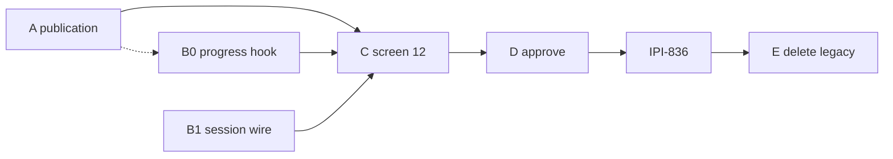
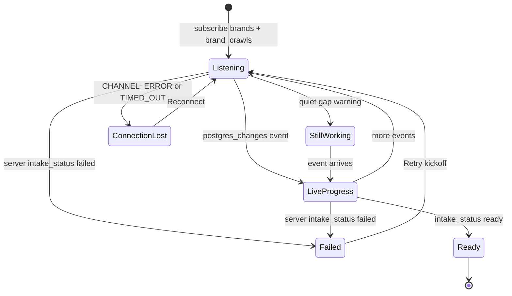
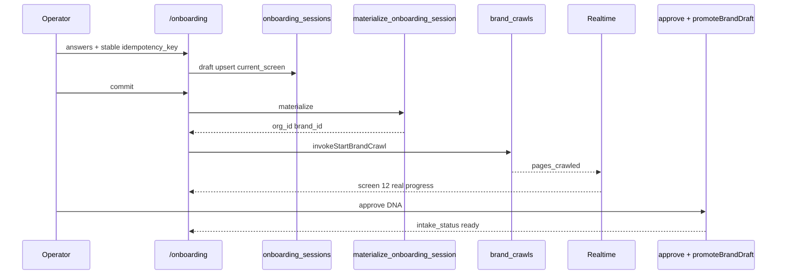

# IPI-835 · ONB2-INT-001 — Real Session, Crawl, Realtime Progress, and Approval (corrected plan)

**Linear:** [IPI-835](https://linear.app/amo100/issue/IPI-835/ipi-835-onb2-int-001-real-session-crawl-realtime-progress-and-approval)  
**Status:** Todo · **Parent:** IPI-831  
**Corrected:** 2026-08-01 (task-verifier Full → packaging fixes applied)  
**Baseline probe:** `origin/main` @ `5020a42d` · prod pub = `brand_crawls` + `brand_crawl_results` only (`brands` absent)

---

## Plain English

Connect `/onboarding` to a real saved session, a real brand crawl, live progress (not a fake timer), and human approval — with recovery if the tab dies mid-run.

**Today:** screen 12 fills on a client timer; Brand Hub listens to `brands` but Realtime never publishes that table.  
**After this:** progress matches crawl + `intake_status` truth; “lost connection” ≠ “analysis failed.”

---

## Corrections applied (vs original Linear)

| # | Was wrong / risky | Corrected |
|---|-------------------|-----------|
| 1 | Slice B deletes `/app/onboarding` with first wire | **Defer delete** until **IPI-836** green (redirect/flag first) |
| 2 | Progress work centered on Brand Hub banner only | **Primary surface = onboarding screen 12** (`AnalysisProgressScreen`); banner shares one hook |
| 3 | “Blocked by 832/833/834 still parallel” | All **Done** — start Slice A now |
| 4 | Banner treats `scores_complete` as success | Terminal success = **`intake_status = ready`** only (`promoteBrandDraft`) |
| 5 | One mega Step 3 | **Six slices** (A → E), one concern per PR |
| 6 | Crawl re-entry unspecified | **Idempotent kickoff** — subscribe only if crawl/lock already in flight |
| 7 | Test paths under root `src/test` | Use **`app/`** vitest paths |

---

## Dependencies (current)

| Issue | Role | State |
|-------|------|:-----:|
| IPI-832 | sessions + materialize RPC | ✅ Done |
| IPI-833 | `/onboarding` UI shell | ✅ Done |
| IPI-834 | Brand DNA contract | ✅ Done |
| IPI-837 | Google → `/onboarding` | ✅ Done |
| IPI-829 | QA DB | ✅ Done |
| IPI-894 | QA race proof (related) | Backlog — parallel |
| IPI-890 | OAuth smoke (related) | Backlog — parallel |
| IPI-836 | Playwright + allowlist (blocks Done claim for cutover) | Todo — after D |

Hard blockers for **starting Slice A:** none.  
Hard blockers for **Done on full product path:** slices A–D landed + tests.  
Hard blockers for **deleting legacy route:** IPI-836 green.

---

## Efficiency ladder — one concern per PR

| Order | Slice | Branch | Concern | Fastest path |
|:-----:|-------|--------|---------|--------------|
| 1 | **A** | `ipi/835a-brands-realtime-publication` | **migration only** | `alter publication … brands (id, intake_status, updated_at)` + pgTAP `009` |
| 2 | **B0** | `ipi/835b0-progress-hook` | **shared hook** | Extract `useBrandAnalysisProgress` from banner; status callback; four states; unit tests |
| 3 | **B1** | `ipi/835b1-session-wire` | **v2 session** | `localStorage` idempotency; draft save; materialize at commit; **keep** `/app/onboarding` |
| 4 | **C** | `ipi/835c-screen12-realtime` | **screen 12** | Replace timer with hook + `format-crawl-progress`; `invokeStartBrandCrawl` with idempotent re-entry |
| 5 | **D** | `ipi/835d-approve-recovery` | **approve** | Screen 13 → existing `POST …/approve` + `promoteBrandDraft`; resume screen from session |
| 6 | **E** | `ipi/835e-retire-legacy` | **delete legacy** | **Only after IPI-836**; redirect then delete `/app/onboarding` |

**Parallel:** A ∥ B0. B1 can start once 832 APIs known (Done). C needs A + B0 + B1. D needs C + 834. E after 836.

---

## Acceptance criteria (execute against these)

### Slice A — publication
- [ ] Migration adds `brands` to `supabase_realtime` with **exactly** `{id, intake_status, updated_at}`
- [ ] pgTAP `009_brands_publication.sql`: attnames match; no `ai_profile_draft` / `analysis_lock_token`
- [ ] Applied on QA + prod; Advisors clean for this change
- [ ] Rollback documented: `alter publication supabase_realtime drop table public.brands;`

### Slice B0 — shared progress hook
- [ ] One hook used by banner (and ready for screen 12)
- [ ] `.subscribe((status) => …)` handles `CHANNEL_ERROR` / `TIMED_OUT` → connection-lost UI (not failed)
- [ ] Quiet gap → “still working” warning only — **never** client-marked failed
- [ ] `intake_status = failed` (server/cron) → failed + Retry
- [ ] Success terminal = `ready` only — **remove** `scores_complete` success branch
- [ ] Unit tests: channel error, timeout reconnect, slow≠failed, server failed, crawl page count

### Slice B1 — session on `/onboarding`
- [ ] Stable `localStorage` idempotency key (refresh resumes same draft)
- [ ] Draft answers + `current_screen` persisted to `onboarding_sessions`
- [ ] Commit calls `materialize_onboarding_session` via existing lib helpers
- [ ] **Does not** delete `/app/onboarding`

### Slice C — screen 12
- [ ] `AnalysisProgressScreen` driven by Realtime / server truth — **no** success/fail timer
- [ ] Page counts from `brand_crawls` via shared formatter
- [ ] Crawl kickoff via `invokeStartBrandCrawl`; re-entry does **not** start a second crawl if one is in flight / analysis locked
- [ ] Offline vs failed UX distinct (from B0 states)

### Slice D — approve + recovery
- [ ] Screen 13 evidence review uses **IPI-834** shape; approve via existing `POST /api/workflows/brand-intelligence/approve`
- [ ] `promoteBrandDraft` leaves `intake_status = ready`
- [ ] Resume restores answers + screen from session; hash/`replaceState` stays consistent (related IPI-840)

### Slice E — retire legacy (after IPI-836)
- [ ] Redirect `/app/onboarding` → `/onboarding` (or allowlist gate)
- [ ] Then delete legacy create page
- [ ] Playwright (**IPI-836**) green before delete

### Explicit non-goals (this issue)
- Playwright journeys → **IPI-836**
- New approval route / second Brand DNA Zod SSOT
- Client stall detector that marks failed
- `NEXT_PUBLIC_ONBOARDING_V2_ENABLED`
- Mega onboarding status enum

---

## Reuse — do not rebuild

| Need | Use | Do not build |
|------|-----|--------------|
| Approval | `POST /api/workflows/brand-intelligence/approve` | second approval route |
| Promotion | `promoteBrandDraft` | parallel write path |
| Terminal failure | `expire_stale_brand_analysis()` cron | client fail timer |
| Crawl kickoff | `invokeStartBrandCrawl` | new crawl client |
| Progress text | `format-crawl-progress.ts` | second formatter |
| Progress UI | shared hook + banner + screen 12 | second progress bus |
| Sessions | `getOrCreateOnboardingSession` / materialize RPC | CopilotKit agent state |

---

## Progress UX state machine

**Pinned rule:** the client never decides a run has failed. Only the server does.

---

## Target sequence

---

## Tests (by slice)

| Slice | Command / file |
|-------|----------------|
| A | `supabase test db --db-url "$QA_DATABASE_URL" supabase/tests/database/009_brands_publication.sql` |
| B0 | `cd app && npx vitest run src/components/brand-hub/analysis-progress-banner.test.tsx` (+ hook tests) |
| B1/C/D | `cd app && npx vitest run src/test/onboarding.test.ts src/test/onboarding-orchestration.test.ts src/components/onboarding/` |
| All app | `cd app && npm run lint && npm run typecheck` |

No Playwright in this issue → **IPI-836**.

---

## Files (expected)

| Path | Slice |
|------|-------|
| `supabase/migrations/<ts>_brands_realtime_publication.sql` | A |
| `supabase/tests/database/009_brands_publication.sql` | A |
| `app/src/lib/brand-hub/use-brand-analysis-progress.ts` (or equiv) | B0 |
| `app/src/components/brand-hub/analysis-progress-banner.tsx` | B0 |
| `app/src/lib/onboarding/index.ts` + `/onboarding` flow | B1 |
| `app/src/components/onboarding/analysis-progress-screen.tsx` | C |
| onboarding DNA / approve wiring | D |
| `app/src/app/(operator)/app/onboarding/page.tsx` | E only |

---

## Traps

- Approval sets **`ready`**, not `scores_complete` / `approved_profile_at`
- No `pending_approval` enum value
- No email path — don’t promise one
- No client `select:` on postgres_changes — publication is the column filter
- `updated_at` freshness ≠ workflow alive
- Don’t delete legacy before **IPI-836**

---

## Rollback

| Slice | Rollback |
|-------|----------|
| A | `alter publication supabase_realtime drop table public.brands;` |
| B0–D | revert PR; `/app/onboarding` still works |
| E | restore redirect or restore page from git |

---

## Skills

`ipix-supabase` · `nextjs-developer` · `mastra` · `gen-test` · `ponytail` · `task-verifier`

---

## Next action

1. Open **Slice A** PR (`ipi/835a-brands-realtime-publication`).  
2. Parallel: **B0** hook + **IPI-894** race on QA.  
3. Then B1 → C → D; E only after **IPI-836**.

---

## Appendix — verifier scores (2026-08-01)

| Spec | Execution | Skills | Composite |
|-----:|----------:|-------:|----------:|
| 78→**90*** | 42 | 88 | **~72*** after this correction |

\*Spec score rises once Linear matches this plan; execution stays low until code lands.

Full probe table lived in the prior audit pass (same date); claims re-verified against prod publication + disk before writing this correction.
