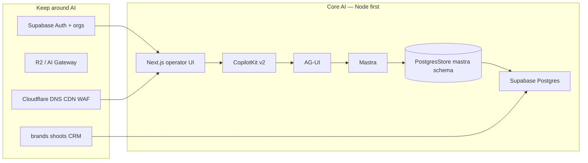

# iPix rebuild from scratch — master plan

**Date:** 2026-08-23  
**Status:** planning only — current production `app/` stays live  
**Task backlog:** [12-task-roadmap.md](12-task-roadmap.md) · **Check-off order:** [todo.md](todo-draft.md) (Wave 0 = fix Supabase first)  
**Verified:** 2026-08-23 against `app/src/mastra/storage.ts`, live npm, [docs/mastra/04-supabase-postgres-audit.md](../mastra/04-supabase-postgres-audit.md)

Read this folder **in number order**. This README is the executive brief; numbered docs are the evidence and the build sequence.

**Three gates before porting UI:** package family proven → Mastra schema contract vs *preview* DB proven → golden persist+403 proven.

| # | Doc | What it is |
| - | --- | ---------- |
| — | [README.md](./README.md) | Decision: new foundation + reuse iPix product |
| 01 | [01-current-state-audit.md](01-current-state-audit.md) | Live runtime, packages, what is proven vs broken |
| 02 | [02-keep-rebuild-matrix.md](02-keep-rebuild-matrix.md) | KEEP / PORT / REBUILD with fashion examples |
| 03 | [03-repo-review.md](copilotkit-mastra/03-repo-review.md) | GitHub example scores |
| 04 | [04-example-catalog.md](copilotkit-mastra/04-example-catalog.md) | One starter + reference examples |
| 05 | [05-starter-decision.md](05-starter-decision.md) | Why `integrations/mastra`, not mastra-pm |
| 06 | [06-example-adoption.md](06-example-adoption.md) | How to copy official APIs into iPix |
| 07 | [07-repo-to-task-map.md](07-repo-to-task-map.md) | Repo → proposed Linear tasks |
| 08 | [08-custom-code-reduction.md](08-custom-code-reduction.md) | Glue to delete vs official replacement |
| 09 | [09-build-plan.md](09-build-plan.md) | Target architecture + golden journey |
| 10 | [10-core-mvp-advanced.md](10-core-mvp-advanced.md) | Phased product scope |
| 11 | [11-product-plan.md](11-product-plan.md) | Full product reuse / stage plan |
| 12 | [12-task-roadmap.md](12-task-roadmap.md) | Sequential implementation tasks |
| 13 | [13-mastra-rebuild.md](13-mastra-rebuild.md) | Mastra agents/tools/workflows reuse |
| 14 | [14-operating-rules.md](14-operating-rules.md) | Env matrix, reuse register, authz/idempotency, HITL, CI |
| — | [adr/](./adr/) | Short ADRs (Node first, Mastra memory, tenancy, CF deferred) |

**Live numbers SSOT:** [01-current-state-audit.md](01-current-state-audit.md) (2026-08-23: 34 tables, 45 threads, 101 messages, `mastra_workflow_definitions` present / 0 rows).

**Live Supabase architecture pack (2026-08-24, read-only):** [data/README.md](./data/README.md) — schemas, ERDs, RLS, RPCs, Edge, Mastra, scores.

**Live Cloudflare pack (2026-08-24, read-only):** [cloudflare/README.md](./cloudflare/README.md) — Workers, DNS, native AI Gateway `ipix-prod`, Hyperdrive. Node first; do not copy `ipix-operator`.

**Goal:** new clean technical foundation + reuse proven iPix pages, components, agents, tools, workflows, schemas, and designs.

**Execution readiness today:** architecture is ready; **implementation has not started.** `amo-tech-ai/ipix` is an empty GitHub repo. First proof is bootstrap + one package family + build, not another architecture pass.

**Production-ready for this plan means:** Core golden chat persists in `mastra.*`, org isolation holds, auth is fail-closed, and current production is never cut over until that proof is green.

---

## 1. Executive recommendation

Do **not** fork today’s 681-line CopilotKit route onto Workers. Do **not** redesign Command Center, Brand, Shoots, or OperatorShell.

Build a **parallel app** from the official CopilotKit Mastra starter, then port iPix product code in.

```text
New Next.js App Router (Node / Vercel first)
  → CopilotKit v2 (`createCopilotRuntimeHandler` from `@copilotkit/runtime/v2`)
    → AG-UI (`MastraAgent.getLocalAgents`)
      → Mastra (in-process)
        → PostgresStore (`id` + `schemaName: "mastra"` + `disableInit: true`)
          → **preview/staging** `mastra` schema first (not production threads on day one)
```

**Why this is better than alternatives**

| Alternative | Why not |
| ----------- | ------- |
| Patch current `route.ts` | Compatibility museum (ALS, idle timeout, Worker shims, interrupt clone). Proven not to restore on refresh. |
| Start on Cloudflare Workers | OpenNext + Hyperdrive + `MASTRA_STORAGE_MODE=noop` flags are why persistence never became the golden path. |
| `canvas/mastra-pm` as starter | Product UX gold; packages are older (CopilotKit 1.10 / Mastra 0.16). |
| New Supabase AI tables | Duplicates `mastra.*`. Forbidden. |
| CopilotKit Intelligence as Core persist | License ≠ durable threads. Use Mastra Memory + PostgresStore first. |

**Keep current iPix running.** Cut over only after the Core golden test (unique `TEST-<uuid>` persist / refresh / restart / Org B 403) on **preview** Mastra storage.

**Primary starter:** [CopilotKit `examples/integrations/mastra`](https://github.com/CopilotKit/CopilotKit/tree/main/examples/integrations/mastra)  
**Replace immediately:** demo user, `InMemoryAgentRunner` as persist, weather agent, LibSQL.

**Scores after verified corrections:** architecture **95/100** · confidence **94%** · UI/domain reuse **~65%** · runtime custom-code cut **~65–75%**.

### Verified corrections (2026-08-23)

The architecture is right. These implementation details were **wrong or too aggressive** in the first draft and are now fixed:

| Claim | Verdict | Evidence |
| ----- | ------- | -------- |
| `new PostgresStore({ schema: "mastra" })` | **Wrong** | Live code: `id`, `connectionString`, **`schemaName`**, **`disableInit: true`** (`app/src/mastra/storage.ts`). **Verify installed `@mastra/pg` types before coding.** |
| Pin CopilotKit `1.69.x` blindly | **Wrong rule** | `npm view` 2026-08-23: runtime/react-core/react-ui all **1.69.0**. Still pin the **starter-compatible family**. `@ag-ui/mastra@1.1.2` wants `@mastra/core` ≥1.29; `@mastra/pg@1.21.1` wants core ≥1.53 |
| Write new runtime into production `mastra.*` on day one | **Too aggressive** | 45 threads / 101 messages live. Use preview/branch DB (or isolated schema) until gold |
| Connect PG before schema-contract diff | **Still required** | Live catalog **now has** `mastra_workflow_definitions` (0 rows, IPI-1008). Historical `42P01` is closed. Diff **new** `@mastra/pg` vs **preview** DB anyway. SSOT: [01](01-current-state-audit.md) |
| Handler AC `&lt;80 lines` | **Guideline only** | Thin route; auth may make it longer |
| `getLocalAgents()` only | **Compare at implement** | Prefer **request-scoped** `getLocalAgent({ mastra, agentId, resourceId })` if types support it |
| `resourceId = org:user` forever | **Core only** | Later shared shoot threads: `org:{orgId}:shoot:{shootId}` |
| `threadId` as capability | **Forbidden** | Locator only; Org B + Org A thread URL = **403** in THR-001 |
| `service_role` can SELECT `mastra.*` | **False** | No schema USAGE for `service_role`. Use pooler/runtime role or Mastra storage API |
| Global `LIKE '%TEST-123%'` | **Weak** | Marker `TEST-<uuid>` + expected thread/resource |
| Raw HAR in PRs | **Unsafe** | Screenshot + sanitized network + SQL |
| Observability / evals only Advanced | **Too late** | Request IDs in Core; traces + Planner evals in MVP foundation |
| Port current scheduler rows | **Do not** | Rebuild one reminder later; 6k snapshots are noise |

Node/Vercel first, one Planner, UI port not redesign, mastra-pm as **feature ref**, dynamic workflows Post-MVP — **keep**. Signals &gt; A2A for shared shoot threads.

---

## 2. Scope (now vs later)

| Now (Core) | After Core (MVP) | Not now (Advanced) |
| ---------- | ---------------- | ------------------ |
| Official CopilotKit + Mastra wiring | OperatorShell, IntelligencePanel, Command Center | MCP, browser research |
| PostgresStore → **preview** `mastra.*` (prod schema only after gold) | Brand, Shoots, Assets, Shoot Wizard | A2A, Intelligence Threads product |
| Supabase Auth + org `resourceId` | Shared state, GenUI, HITL, working memory | Chatwoot/WhatsApp, Postiz |
| Production Planner only | Creative Director, Brand Intelligence | Worker runtime cutover |
| Golden persist test | Essential CRM/booking | Advanced observability |

---

## 3. Risks (read before design)

| Risk | Reversibility | Mitigation |
| ---- | ------------- | ---------- |
| Touching live `mastra.*` / app tables | Hard | Parallel app; same DB read/write only via existing roles; no new `public.mastra_*` |
| Copying current Copilot route | Easy if we refuse | Official handler + thin auth (line count is a guideline) |
| Worker-first rewrite | Hard | Node/Vercel until golden test; CF for DNS/CDN/WAF/R2/AI Gateway only |
| Demo `resourceId: "default"` leaking threads | Hard | Replace on day one with `org:{orgId}:user:{userId}` |
| Snapshot bloat (~6k workflow rows vs 45 threads) | Medium | Do not treat snapshots as chat history; prune later |
| HITL clone hack (`emitInterruptOutcome`) | Medium | Official `useHumanInTheLoop` + Mastra suspend in MVP, not Core |
| Dual Gemini + operator JWT headers | Easy | Keep a 10-line header filter **only if** Google still rejects dual auth |

---

## 4. Current-state KEEP / PORT / REBUILD / REMOVE / DEFER

Verified against `app/` on 2026-08-23: CopilotKit **1.61.2**, Mastra **1.59.0**, `@ag-ui/mastra` **1.1.1**, Next **16.2.11**, route `app/src/app/api/copilotkit/[[...slug]]/route.ts` (~681 lines). Live DB: `mastra.mastra_threads` 45, `mastra_messages` 101, workflow snapshots 6140.

| Item | What it does | Class | Why | How to reuse | Risk / better path |
| ---- | ------------ | ----- | --- | ------------ | ------------------ |
| Operator pages (Command Center, Brand, Shoots, Assets, CRM, Planner) | Product surfaces | **PORT** | Designed + React exists | Copy into new app routes; keep tokens | Do not redesign `.dc.html` |
| OperatorShell / IntelligencePanel | Chrome + rail | **PORT** | High reuse | Mount around Copilot v2 chat | Wire `useAgent` to new runtime |
| Production Planner / Creative Director / Brand Intelligence agents | Fashion domain brain | **PORT** | Tuned prompts/tools | After Core golden; attach tools to starter agent | Keep `default` alias for Copilot prebuilt UI |
| Shoot wizard + brand-intelligence workflows | Multi-step production | **PORT** | Real product | MVP after persist | Not Core |
| Tools (`generateShotListDraft`, booking, CRM, etc.) | HITL-gated writes | **PORT** | Business logic | Same Zod + org checks | Human approval before sensitive writes |
| Supabase Auth, orgs, RLS app data | Tenant + CRM/shoots | **KEEP** | Correct | Same project; no duplicate app schema | App-level org scope; `mastra` RLS is `USING (true)` for runtime role |
| `mastra.*` PostgresStore | Durable AI memory | **KEEP contract** | Live rows exist | `schemaName` + `disableInit: true` + required `MASTRA_SCHEMA`; **preview DB first** | Do not auto-DDL; do not invent `public` AI tables |
| CopilotKit `route.ts` + ALS + idle timeout | Custom runtime | **REBUILD** | Unofficial glue | Ideas only: 401/403 fail-closed, org resourceId | Official `createCopilotRuntimeHandler` |
| `runtime-v2-fetch.ts` Express bypass | Workers barrel workaround | **REMOVE** | Node starter uses `/v2` | Delete | — |
| `InMemoryAgentRunner` as persist | Process-local replay | **REMOVE** from persist story | Dies on restart | Runner OK for stream; persist via Mastra PG | — |
| Interrupt clone / `emitInterruptOutcome` mutation | HITL workaround | **REMOVE** | Unproven ([IPI-1010](https://linear.app/amo100/issue/IPI-1010)) | Official HITL | — |
| OpenNext Worker as Copilot host | CF runtime | **DEFER** | Golden path unproven; storage often noop | DNS/CDN/WAF/R2/AI Gateway now | Re-eval after Node gold |
| CopilotKit Intelligence Threads UI | Hosted thread drawer | **DEFER** | Env incomplete (`isCopilotIntelligenceRuntimeWired() === false`) | Mastra threads first | — |
| MCP / A2A / browser tools | Advanced agents | **DEFER** | Not needed for persist | Showcase repos later | — |
| Vite root `src/` | Legacy dashboard | **REMOVE** from new app | Canonical is `app/` | Do not port | — |
| `MASTRA_STORAGE_MODE=noop` | Worker stub | **REMOVE** from Core | Hides missing PG | Fail closed | — |

**Custom glue to drop:** stream idle wrappers, Worker PG ALS, Hyperdrive in the chat hot path, Intelligence flags that never construct the client, dual-auth header museum beyond a tiny Gemini filter.

---

## 5. Latest-version compatibility matrix

Pin from **installed types + official docs at implement time**. Training data drifts.

| Package | iPix today | Latest verified (2026-08) | Core target | Notes |
| ------- | ---------- | ------------------------- | ----------- | ----- |
| `@copilotkit/runtime` + `react-core` / `react-ui` | 1.61.2 | **Discover at install** (`npm view` 2026-08-23: all three **1.69.0**; do not assume a family from a blog/npm screenshot) | **Newest mutually compatible stable set the CopilotKit Mastra starter typechecks with** | Use `@copilotkit/runtime/v2`. Pin one lockfile; never mix 1.10 + 1.69 |
| `@ag-ui/mastra` | 1.1.1 | Starter ~1.1.2 | Match CopilotKit example lock | `MastraAgent.getLocalAgents({ mastra, resourceId })` |
| `@mastra/core` | 1.59.0 | Track Mastra 1.x line | Latest 1.x compatible with `@ag-ui/mastra` | Verify with `mastraDocs` MCP |
| `@mastra/pg` / Memory | 1.20.0 / 1.26.2 | npm 2026-08-23: `@mastra/pg` **1.21.1**, `@mastra/memory` **1.27.0**, `@mastra/core` **1.61.0** | Compatible with chosen `@ag-ui/mastra` peers (`core` ≥1.29 for ag-ui 1.1.2; pg wants core ≥1.53) | Constructor: **`schemaName` + `disableInit: true`**, not `schema`. Verify installed types before coding |
| `next` | 16.2.11 | 16.x | Stay on 16 App Router | Do not jump majors in Core |
| `@supabase/ssr` + `supabase-js` | 0.12 / 2.108 | Current 2.x | Keep | Auth cookies in new app |
| `@opennextjs/cloudflare` | 1.20.2 | — | **Not in Core** | After golden test |
| Gemini `@ai-sdk/google` | present | Current 3.x | Keep iPix model registry | Swap starter OpenAI |

**If `integrations/mastra` lockfile and `v2/runtime` disagree:** stop and align to installed types. That mismatch is how the current shims accumulated.

---

## 6. Repo scorecard (do not Frankenstein)

| Repo | Currentness | Arch | iPix fit | Persist | Shared state | HITL | GenUI | Prod | Avoid custom | **Total** | Role |
| ---- | ----------: | ---: | -------: | ------: | -----------: | ---: | ----: | ---: | -----------: | --------: | ---- |
| [examples/integrations/mastra](https://github.com/CopilotKit/CopilotKit/tree/main/examples/integrations/mastra) | 98 | 96 | 88 | 40* | 50 | 40 | 45 | 85 | 95 | **97** | **PRIMARY STARTER** |
| [examples/v2/runtime](https://github.com/CopilotKit/CopilotKit/tree/main/examples/v2/runtime) | 95 | 94 | 70 | 30 | 20 | 20 | 15 | 88 | 90 | **93** | Handler contract |
| [examples/v2/react](https://github.com/CopilotKit/CopilotKit/tree/main/examples/v2/react) | 95 | 90 | 72 | 20 | 25 | 30 | 40 | 85 | 90 | **91** | Provider / `useAgent` |
| [examples/canvas/mastra-pm](https://github.com/CopilotKit/CopilotKit/tree/main/examples/canvas/mastra-pm) | 55 | 92 | 96 | 35 | 98 | 80 | 70 | 70 | 80 | **92** | **Feature ref only** |
| [examples/canvas/mastra](https://github.com/CopilotKit/CopilotKit/tree/main/examples/canvas/mastra) | 70 | 88 | 80 | 35 | 85 | 75 | 90 | 72 | 78 | **87** | Canvas / cards |
| [examples/shadcn](https://github.com/CopilotKit/CopilotKit/tree/main/examples/shadcn) | 90 | 80 | 85 | 10 | 20 | 70 | 75 | 80 | 88 | **92** | Chat chrome |
| Generative UI showcase | 90 | 85 | 88 | 15 | 40 | 90 | 98 | 75 | 85 | **94** | Approval cards |
| [template-agent-harness](https://github.com/mastra-ai/template-agent-harness) | 85 | 80 | 60 | 70 | 50 | 40 | 20 | 70 | 75 | **85** | Memory/tasks patterns |
| examples/v1/\* | 20 | 40 | 20 | 10 | 10 | 20 | 20 | 20 | 10 | **22** | **AVOID** |

\*Starter persist is in-memory / LibSQL — **replace with iPix PostgresStore**.

**When to use each**

- **integrations/mastra** — clone structure, AG-UI local agents, Copilot provider. Replace demo identity and storage.
- **v2/runtime + v2/react** — if starter APIs drift; copy handler/provider signatures only.
- **mastra-pm** — map `tasks[]` → shoots/fittings; working memory; live board. Not the app root.
- **canvas/mastra** — card canvas if Shoot board needs visual cards.
- **shadcn** — chat looks like OperatorShell, not a stock widget.
- **generative-ui** — HITL approval cards.
- **agent-harness** — schedules/workspace later; not Core.

**Avoid:** v1 examples, Pydantic/LangGraph canvases, OpenBot as foundation, current iPix Copilot route as template.

---

## 7. Target architecture



**threadId:** CopilotKit thread id = Mastra thread id; create on first Planner send; persist in URL or operator session; never `"default"` for multi-tenant.

**resourceId:** `org:{orgId}:user:{userId}` (existing `makeMemoryResourceId` idea). Org B cannot load Org A thread (403).

**Cloudflare initially:** DNS, CDN, WAF, AI Gateway, R2, Queues. **Not** the Copilot host until the same golden test passes on OpenNext.

---

## 8. Sitemap / page reuse

| Screen | Route | Status | Design `.dc.html` | React | Data | AI | Reuse | Stage |
| ------ | ----- | ------ | ----------------- | ----- | ---- | -- | ----- | ----- |
| Login | `/login` | Live | — | Yes | Auth | No | **PORT** | Core |
| Command Center | `/app` | Live | Command Center.v2 | Yes | Partial | Partial | **PORT** | MVP |
| Brand list | `/app/brand` | Live | Brand List.v2 | Yes | Yes | Partial | **PORT** | MVP |
| Brand detail | `/app/brand/[id]` | Live | Brand Detail.v2 | Yes | Yes | Brand Intel | **PORT** | MVP |
| Shoots list | `/app/shoots` | Live | Shoots List.v2 | Yes | Yes | Partial | **PORT** | MVP |
| Shoot new/wizard | `/app/shoots/new` | Live | Shoot Wizard.v2 | Yes | Yes | Workflow | **PORT** | MVP |
| Shoot detail | `/app/shoots/[shootId]` | Live | Shoot Detail.v2 | Yes | Yes | Partial | **PORT** | MVP |
| Assets | `/app/assets` | Live | Assets.v2 | Yes | Yes | Partial | **PORT** | MVP |
| Planner hub | `/app/planner` | Live | SCR-35 Planner Hub | Yes | Yes | **Core agent** | **PORT** | Core (minimal) + MVP chrome |
| Planner instance | `/app/planner/[instanceId]` | Live | SCR-32 Workspace | Yes | Yes | Yes | **PORT** | Core golden on this surface |
| CRM / pipeline / contacts | `/app/crm/*` | Live | SCR-26–31 | Yes | Yes | Tools | **PORT** | MVP essential only |
| Matching / talent | `/app/matching*` `/app/talent*` | Live | Matching / Talent | Yes | Yes | Tools | **PORT** | MVP / Advanced |
| Campaigns / analytics / inbox | `/app/campaigns` etc. | Live | Campaigns / Analytics | Yes | Mixed | Weak | **PORT / DEFER** | Advanced if unused |
| Marketing site | `/(marketing)/*` | Live | — | Yes | Static | No | **KEEP current** or copy last | Not Core |
| OperatorShell | layout | Live | OperatorShell.dc.html | Yes | — | Chat dock | **PORT** | MVP |
| IntelligencePanel | rail | Live | IntelligencePanel.dc.html | Yes | Partial | Partial | **PORT** | MVP |
| Vite `src/` pages | root | Retiring | — | Duplicate | — | — | **REMOVE** | Never |

**Port method:** copy page + colocated components + tokens; point data hooks at same Supabase; swap Copilot provider to new `/api/copilotkit`. Combine only obvious duplicates (two onboarding routes). Do not merge Brand + Shoots.

---

## 9. Core golden-test specification

```text
User A authenticates → server derives org A
→ new thread UUID (locator, not a capability)
→ send TEST-<uuid>
→ stream completes
→ exact row: expected threadId + resourceId + marker
→ hard refresh restores from Postgres
→ restart Node → still restores
→ User B opens same thread URL → 403, no User-A content
→ User B can start a new thread normally
```

Run this against **preview/staging Mastra storage**, not production `mastra.*`.

**Required files (new app)**

- `src/mastra/index.ts` — Mastra + PostgresStore + Planner agent + Memory
- `src/app/api/copilotkit/[[...slug]]/route.ts` — official handler + auth + org resourceId
- `src/app/layout.tsx` — CopilotKit provider `/v2`
- `src/app/(operator)/app/planner/page.tsx` — `useAgent({ agentId: "production-planner" })` + `threadId`
- Auth helpers from current `app/src/lib/auth` / operator gate (port, don’t rewrite)

**Packages:** CopilotKit + Mastra **compatible family** proven in IPI-V2-002 (not “install every latest”). `@ai-sdk/google`, `@supabase/ssr`.

**threadId:** generated UUID in `?thread=`; **not** authorization. Server checks org ownership every request. Core `resourceId = org:{orgId}:user:{userId}`; future shared shoots may use `org:{orgId}:shoot:{shootId}`.

**Errors:** 401 no session, 403 no org / wrong tenant, 500 sanitized; no hung SSE without timeout **until** official stream is proven (then add timeout only if still needed).

**Tests:** Vitest auth fail-closed; SQL via **Mastra Memory API + trusted DB role** (not `service_role`); Playwright: unique marker → reload → text visible. Proof: screenshot + sanitized network + SQL id — **no raw HAR with cookies**.

**Browser proof:** screenshot + sanitized network + SQL row id. Not unit tests alone. No raw HAR with cookies.

---

## 10. Core / MVP / Advanced

See also [10-core-mvp-advanced.md](10-core-mvp-advanced.md).

| Stage | Includes | Gate |
| ----- | -------- | ---- |
| **Core** | New Next app, CopilotKit v2, AG-UI, Mastra, **preview** PostgresStore, Auth, org isolation, Planner, persistent thread, golden test | Unique `TEST-<uuid>` persist + 403 |
| **MVP foundation** | OperatorShell, traces in staging, official HITL, GenUI, task tracking, Planner evals | Screen loads + one AI action; evals green |
| **MVP product** | Brand, Brand Intelligence, Shoots, Shoot Wizard, Assets, Creative Director, essential CRM | Each screen + one AI action |
| **Post-MVP** | Shared shoot threads, **Signals**, background tasks, **clean** schedules (not current dispatcher dump) | Separate tickets |
| **Advanced** | Dynamic workflows, WhatsApp, MCP Apps, supervisor, sampling/dashboards | Separate epics |
| **Experimental** | A2A (after Signals), ACP, browser agents, semantic recall | Showcase only |

---

## 11. Linear task list

Canonical ordered backlog: **[12-task-roadmap.md](12-task-roadmap.md)**. All IDs are **PROPOSED** (`IPI-V2-xxx`) until created in Linear.

Epic A Clean AI Runtime → B UI Reuse → C AI-native MVP → D Cloudflare → E Advanced.

---

## 12. Efficiency review (ponytail)

Every task prefers: existing iPix code → official starter → official SDK → example → smallest custom.

| Temptation | Faster/safer path |
| ---------- | ----------------- |
| Custom thread table | Mastra PostgresStore |
| Custom SSE proxy | `createCopilotRuntimeHandler` |
| New design system | Port tokens + shadcn example for chat only |
| Worker persist first | Node persist first |
| Intelligence for Core | Mastra Memory |
| Rewrite Planner prompts | Copy agent files after gold |

---

## 13. Migration sequence (current → new)

1. Keep production `app/` on Vercel unchanged.
2. Scaffold `app-v2/` (or worktree) from `examples/integrations/mastra`.
3. Same Supabase **app** data (read brands/shoots). Mastra storage = **preview/branch DB or isolated schema** until gold, then switch.
4. Pass Core golden on preview URL.
5. Port Planner UI, then OperatorShell, then Brand/Shoots.
6. Attach real tools/workflows.
7. HITL + GenUI.
8. Preview-only OpenNext Worker; same golden test.
9. DNS cutover only if Worker gold matches Node.
10. Decommission old Copilot route.

---

## 14. Production-readiness checklist

- [ ] Golden unique `TEST-<uuid>`: stream + SQL + refresh + restart + cross-org 403 (preview storage)
- [ ] No `public.mastra_*`
- [ ] `MASTRA_SCHEMA=mastra` required
- [ ] Operator JWT never in client AI keys
- [ ] HITL before shoot/CRM writes
- [ ] Current production still serving
- [ ] Copilot route thin (official handler + auth/org); no line-count fetish
- [ ] No Worker shims in Core
- [ ] Preview URL evidence (screenshot + sanitized network + SQL)
- [ ] Linear issue not marked Done from unit tests alone

---

## 15. Scores

| Metric | Value |
| ------ | ----- |
| Current overall (from audit) | **52/100** |
| Target architecture (after corrections) | **95/100** |
| UI/domain reuse | **~65%** |
| Agent/tool reuse | **~80%** after Core |
| Runtime custom-code reduction | **~65–75%** |
| Confidence this plan is right | **94%** |
| Confidence Core ships if we do not skip the three gates | **~90%** |

Remaining uncertainty: exact CopilotKit × `@ag-ui/mastra` × `@mastra/pg` lockfile (prove at install), request-scoped `getLocalAgent` vs `getLocalAgents` on installed types, Gemini dual-auth header strip.

---

## 16. Later / not now

Worker as Copilot host, CopilotKit Intelligence product, MCP, A2A (Signals first for shared shoots), WhatsApp, Postiz, copying the current dispatcher/scheduler rows, snapshot pruning as a product feature, Vite dashboard, new app-data schema, redesign of v2 `.dc.html` pages.

---

## 17. Next

Execute [12-task-roadmap.md](12-task-roadmap.md) Task 0 onward in a worktree. Do not edit production Copilot route as part of this rebuild.
