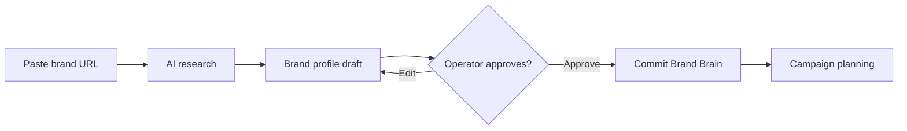
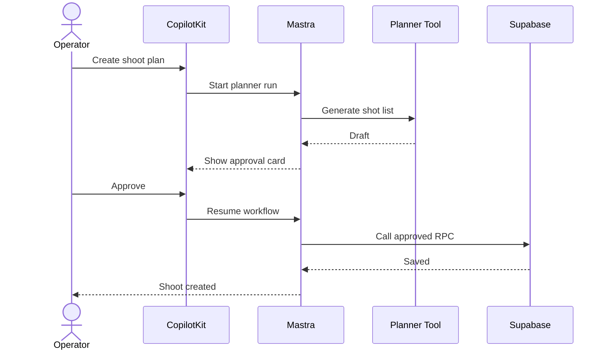
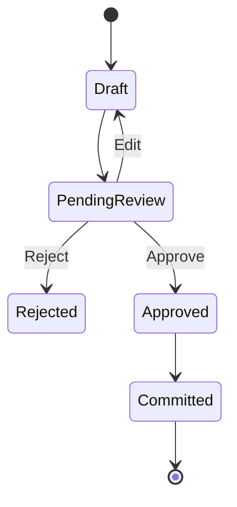
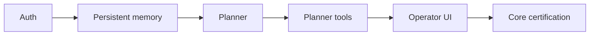
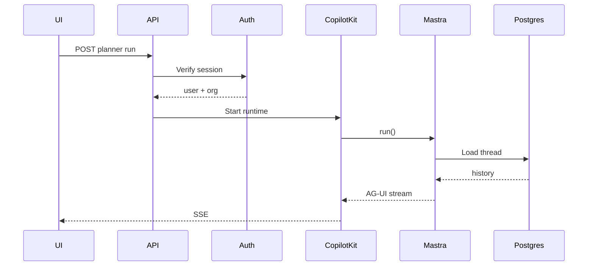

Yes. For iPix, Mermaid should become part of the **engineering workflow**, not just documentation.

Mermaid’s current official syntax covers architecture, flowcharts, sequence diagrams, state diagrams, ER diagrams, user journeys, Gantt, requirement diagrams, Git graphs, mindmaps, timelines, Kanban, event modeling, and more. ([Mermaid](https://mermaid.js.org/syntax/flowchart?utm_source=chatgpt.com "Flowcharts Syntax | Mermaid"))

## Best ways to use Mermaid in iPix

|Priority|Use|iPix example|Diagram|Value|
|--:|---|---|---|--:|
|1|**Architecture truth**|Browser → CopilotKit → Mastra → Supabase → Cloudinary|Architecture|**100/100**|
|2|**User journeys**|Brand URL → research → editable draft → approval → Brand Brain|Flowchart|**100/100**|
|3|**AI/tool interactions**|User → CopilotKit → Planner → tool → RPC → Supabase|Sequence|**100/100**|
|4|**HITL rules**|Draft → review → approved/rejected → committed|State|**99/100**|
|5|**Database/domain relationships**|Brand → Campaign → Shoot → Asset → Product|ER|**98/100**|
|6|**Linear dependencies**|Auth → memory → planner → tools → workspace|Flowchart|**98/100**|
|7|**Acceptance criteria traceability**|Requirement → implementation → test|Requirement|**97/100**|
|8|**Roadmaps**|Core → MVP → Campaigns → Shoots → Publishing|Gantt|**92/100**|
|9|**PR change visualization**|Before architecture → changed components → new flow|Architecture/flow|**95/100**|
|10|**Production debugging**|Request enters → auth → stream → agent → DB → failure point|Sequence|**98/100**|

Mermaid's official **Architecture diagram** is particularly useful for iPix because it is explicitly designed to show services, resources, groups, and their connections. ([Mermaid](https://mermaid.js.org/syntax/architecture.html?source=post_page-----a7ffe1d1aef1--------------------------------&utm_source=chatgpt.com "Architecture Diagrams Documentation (v11.1.0+) | Mermaid"))

---

# 1. Make architecture visible before coding

For important tasks, generate the intended architecture first.

Example:


This is better than a paragraph saying:

> CopilotKit talks to Mastra, which uses Supabase and Cloudinary.

The diagram immediately exposes wrong ownership.

### iPix rule

```text
Architecture-changing task
→ update architecture diagram
→ implement
→ compare implementation to diagram
→ verify
```

---

# 2. Diagram every important user journey

This is probably the **highest-value use** for iPix.

Example:



This tells engineering exactly what “done” means.

It also prevents a common failure:

```text
AI generated result
≠ feature complete
```

The feature is complete only when:

```text
User starts
→ AI assists
→ user reviews
→ approved result persists
→ user sees confirmation
```

---

# 3. Use sequence diagrams for CopilotKit + Mastra

Official Mermaid sequence diagrams are specifically intended to show processes interacting and **in what order**. ([Mermaid](https://mermaid.js.org/syntax/sequenceDiagram.html?utm_source=chatgpt.com "Sequence diagrams | Mermaid"))

This is ideal for AI systems because order matters.

Example:



This diagram can reveal bugs before coding:

- write happens before approval
    
- wrong service talks directly to Supabase
    
- missing authentication
    
- no retry
    
- no failure branch
    
- UI never receives completion
    

---

# 4. Model HITL as a state machine

Mermaid officially supports finite state diagrams. ([Mermaid](https://mermaid.js.org/syntax/stateDiagram?utm_source=chatgpt.com "State diagrams | Mermaid"))

For iPix:



This should become standard for:

- Brand Brain approval
    
- Campaign approval
    
- Shoot plan approval
    
- Asset DNA review
    
- Product linking
    
- Publishing
    
- Payments/contracts later
    

It enforces your core rule:

> AI proposes → human reviews → approved action executes.

---

# 5. Turn requirements into verifiable diagrams

This is underused but very useful.

Mermaid supports **SysML-style requirement diagrams**, including relationships such as:

- `satisfies`
    
- `verifies`
    
- `traces`
    
- `derives`
    
- `refines` ([Mermaid](https://mermaid.js.org/syntax/requirementDiagram.html?utm_source=chatgpt.com "Requirement Diagram | Mermaid"))
    

Example:

```mermaid
requirementDiagram

requirement HITL {
    id: REQ-01
    text: All consequential writes require approval
    risk: high
    verifymethod: test
}

element ApprovalCard {
    type: React Component
}

element PlaywrightTest {
    type: E2E Test
}

ApprovalCard - satisfies -> HITL
PlaywrightTest - verifies -> HITL
```

This is powerful for Linear tasks.

Instead of:

```text
Requirement → vague code → tests
```

you get:

```text
Requirement
   ↓ satisfied by
Implementation
   ↓ verified by
Test
```

---

# 6. Diagram Linear dependencies before implementation

Example:



This makes incorrect development order obvious.

For iPix roadmap reviews, Mermaid can answer:

> What can start now?

> What is blocked?

> What can run in parallel?

That is more useful than a flat numbered task list.

---

# 7. Use Mermaid as an AI planning input

This is where your pasted article is directionally right.

Use Mermaid not only as **output from AI**, but as **input back into AI**.

Example:

```text
Existing architecture diagram
        ↓
Cursor / AI reads diagram
        ↓
Compare with repository
        ↓
Detect architecture drift
        ↓
Suggest smallest correction
```

A task prompt could say:

> Read `docs/architecture/runtime.mmd`. Compare it with the current code. Report every place where implementation disagrees with the diagram. Do not modify code until the discrepancy is verified.

That turns diagrams into machine-readable architectural contracts.

---

# 8. Generate diagrams automatically during task audits

For substantial Linear tasks, I recommend this standard:

```text
Task review
   ↓
Dependency diagram
   ↓
User journey
   ↓
System sequence
   ↓
Implementation
   ↓
Tests
   ↓
Updated diagram
```

Not every task needs all three.

Use this rule:

|Task|Required diagram|
|---|---|
|UI feature|User journey|
|AI workflow|Sequence + state|
|Database work|ER|
|Architecture change|Architecture|
|Multi-step workflow|Flowchart|
|Major roadmap/epic|Dependency graph|
|HITL feature|State|
|High-risk requirement|Requirement diagram|

---

# 9. Use Mermaid during debugging

Example: Planner streaming bug.

Instead of reading dozens of files randomly:



Then ask:

> At which arrow does reality stop matching this diagram?

That drastically narrows debugging.

---

# 10. Make diagrams part of Definition of Done

For architecture-affecting tasks:

```text
[ ] Diagram represents intended behavior
[ ] Implementation matches diagram
[ ] Diagram uses current service ownership
[ ] Failure paths shown
[ ] Approval points shown
[ ] Source-of-truth boundaries shown
[ ] Diagram validates with mcp-mermaid
[ ] Diagram committed beside relevant docs
```

## Recommended iPix structure

```text
docs/
  architecture/
    system.mmd
    ai-runtime.mmd
    data-ownership.mmd

  journeys/
    brand-intake.mmd
    campaign-create.mmd
    shoot-plan.mmd
    asset-review.mmd

  workflows/
    planner-hitl.mmd
    publishing.mmd

  data/
    brand-campaign-shoot.mmd
```

Keep the `.mmd` text in Git.

Generate PNG/SVG only when needed for Linear, PRs, presentations, or stakeholder reviews.

---

# Best iPix Mermaid workflow

```text
Linear task
      ↓
AI reads current code + task
      ↓
Generate Mermaid diagram
      ↓
mcp-mermaid validates it
      ↓
Human reviews architecture
      ↓
Implement smallest correct change
      ↓
Run tests
      ↓
AI compares code ↔ diagram ↔ acceptance criteria
      ↓
Update Mermaid if architecture legitimately changed
      ↓
PR
```

This is the important shift:

> **Mermaid becomes an executable thinking aid for AI development, not decoration.**

### Recommended adoption score

|Area|Score|
|---|--:|
|Architecture clarity|**100/100**|
|AI planning|**98/100**|
|Debugging|**96/100**|
|Task dependency reasoning|**98/100**|
|Human/AI alignment|**99/100**|
|Documentation maintenance|**95/100**|
|Development speed|**94/100**|
|**Overall iPix value**|**97/100**|

One caution: treat Mermaid as a **representation of the architecture**, not the ultimate source of runtime truth. Current code, tests, live database contracts, and verified runtime state still outrank a stale diagram.

## Summary:

- **Best decision:** make Mermaid mandatory for important cross-system iPix tasks.
    
- **Highest-value diagrams:** user journey, sequence, state, architecture, ER, and dependency graphs.
    
- **Next action:** update the iPix `mermaid-diagrams` skill so important Linear tasks automatically generate, validate, and verify the appropriate diagram using `mcp-mermaid`.